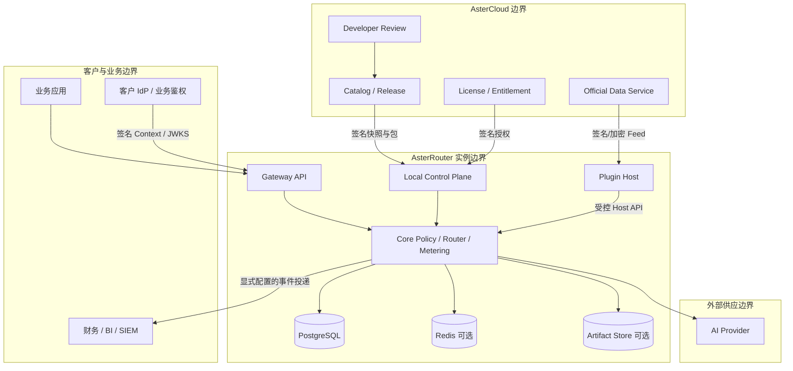

# 产品定位与系统边界

## 1. 一句话定位

AsterRouter 是可私有部署、可离线自治、可通过插件扩展的 AI 访问与供应平台。它面向需要统一接入多个 AI Provider，并对身份、策略、路由、容量、成本、用量、异步任务和媒体产物进行治理的团队。

它不是单纯的反向代理，也不是把所有 AI 业务收进一个大平台。核心价值在于稳定契约与可信执行：业务应用只依赖 AsterRouter 的 Gateway API；Provider、账号、价格和策略可以在不修改业务应用的前提下受控演进。

## 2. 目标客户与核心问题

| 客户类型 | 当前痛点 | AsterRouter 价值 |
| --- | --- | --- |
| 企业 AI 平台团队 | Provider 分散、密钥泄露、重复代理、缺少部门治理 | 私有控制面、统一 Key、模型目录、预算、审计和成本分摊 |
| AI API / 中转运营者 | 多账号调度复杂、余额与容量不透明、客户计费难解释 | 账号池、健康与容量路由、客户隔离、用量与账务证据 |
| SaaS / Agent 产品 | 业务鉴权与 AI 网关耦合、外部租户难隔离 | External Auth Context、Gateway Principal、Usage Sink |
| 多模态内容平台 | 长任务、回调、媒体存储和供应商协议差异巨大 | Durable Job、Provider Adapter、Artifact Policy、统一计量 |
| 私有化软件供应商 | 客户环境异构、离线授权、扩展需求不可控 | 单一发行物、Profile、签名插件、离线目录与 License |

## 3. 产品目标

| 编号 | 目标 | 结果指标 |
| --- | --- | --- |
| G-01 | 一个稳定 API 接入多云、多 Provider、多模态能力 | 业务侧不再保存 Provider Secret 或实现供应商重试 |
| G-02 | 每次调用的身份、决策、尝试、用量和成本可追溯 | 成功结算调用的事实关联完整率 100% |
| G-03 | 私有部署可独立运行，官方服务可选增强 | AsterCloud 故障不影响有效授权内的数据面 |
| G-04 | 通过插件扩展而不破坏 Core 不变量 | 插件无 Core DB/Redis 直写权限，停机故障域可控 |
| G-05 | 同一架构覆盖个人、运营商、企业和平台集成 | 部署角色复用同一 Core，不维护四套后端 |
| G-06 | Direct、Realtime、Durable 共享治理与账务语义 | 不因通道不同产生身份、用量和结算双口径 |

## 4. 非目标

- 不在 AsterRouter Core 内建设通用 CRM、支付收单、税务、发票或渠道分润系统。
- 不替代业务产品的终端用户注册、登录、Session 和业务权益系统。
- 不承诺把所有 Provider 私有能力无损转换成同一协议；公共能力规范化，差异能力通过显式扩展暴露。
- 不允许第三方插件在 Gateway 热路径执行无界远程调用或获得数据库写权限。
- 不默认把 Prompt、Response、Provider Secret、Key 或逐请求 Usage 上传 AsterCloud。
- 不以“智能路由”名义引入不可解释、不可回放、不可设硬约束的黑盒决策。
- 不在首阶段同时承诺多活多 Region、完整商业市场和任意插件语言运行时。

## 5. 系统边界

### 5.1 AsterRouter Core 负责

- 接入协议、认证上下文归一、Scope 与策略执行。
- Provider、Provider Account、模型能力、Route 与容量调度。
- Direct/Realtime/Durable 执行，幂等、重试、取消和恢复。
- Usage 标准化、价格快照、预扣/结算、成本与节省证据。
- Artifact 元数据、存储策略、访问授权、交付和删除证据。
- 本地用户、组织、角色、Gateway Principal、API Key 与审计。
- 插件安装、兼容性、授权、配置、Supervisor、Host API 和贡献面。

### 5.2 AsterCloud 负责

- 官方 Core Release、插件目录、包、签名、兼容性与安全撤销。
- 客户、产品、SKU、License、Entitlement、兑换码和服务订阅。
- 插件开发者、项目、上传、自动扫描、人工审核和发布。
- Provider Intelligence、官方服务版本和加密数据 Feed。
- 在线激活与离线 License/Feed 的签发，不远程控制本地运行时。

### 5.3 插件负责

- 以 manifest 声明身份、版本、运行时、Surface、能力、权限和兼容性。
- 实现场景 UI、Provider Adapter、数据服务消费、通知或报表等明确扩展点。
- 通过 Plugin Host 获取短期、最小 Scope 的访问，不直接访问 Core 存储。
- 将 Provider 私有协议映射为 Core 规范，不自行决定租户权限、计量和结算。

### 5.4 外部业务系统负责

- 终端用户生命周期、业务 Session、套餐权益、订单和产品体验。
- 通过 External Auth Integration 或受保护后端将可信身份上下文交给 AsterRouter。
- 消费 Usage Sink、Webhook 或报表完成业务计费与客户运营。

## 6. 部署角色不是系统分叉

| Profile | 首要用户 | 默认 Surface | 典型边界 |
| --- | --- | --- | --- |
| Personal | 个人与小团队 | Console / Workbench | 本地凭据与轻量任务，不承诺多租户商业运营 |
| Relay Operator | API 运营者 | Operator / Customer | 客户、套餐、余额和账号池；商业模型保持 Profile 内隔离 |
| Enterprise | 企业 IT / AI 平台 | Admin / Portal | 员工、部门、组织组、治理、成本分摊和插件 |
| Platform | 外部 SaaS / 平台 | Platform / Integration Portal | 平台租户、Principal、外部鉴权和 Usage Sink |

一个新安装只选择一个 Profile。Profile 决定初始化数据、导航、权限和默认插件，不复制 Core 服务。未来多 Profile 必须先完成 `profile_scope` 数据隔离和迁移工具，不能直接开放多选开关。

## 7. 产品原则

1. **Local-first**：客户请求和私有事实默认留在本地实例。
2. **Core owns truth**：影响访问、成本和审计的最终事实由 Core 持有。
3. **Explicit over magical**：路由、降级、价格和授权都有版本与 reason code。
4. **Fail closed on trust**：签名、授权、身份或 Secret 校验不确定时拒绝扩大权限。
5. **Degrade without corruption**：依赖故障可以降级服务，但不能生成重复 Job、漏计费或越权产物。
6. **One model, multiple surfaces**：UI 和 Profile 可不同，领域模型与 API 不分叉。
7. **Compatibility is temporary**：兼容层有调用方、指标、owner 和退出条件。

## 8. 成功标准

- 新应用只需一个 Base URL 和一种可信 Credential 即可完成首个调用。
- Provider 切换、账号冷却和价格调整无需业务应用发布。
- 任一 `request_id` 或 `job_id` 可关联身份、策略、路由尝试、Provider 状态、Usage、价格与 Artifact。
- 禁用 AsterCloud 网络后，已安装插件和有效 License 在授权窗口内可继续工作。
- 恶意或故障插件无法读取未授权 Secret、跨租户数据或使 Core 账务产生不一致。
- 单机、分角色进程和多副本部署使用相同状态机与验收套件。

## 9. 关键决策

| ADR | 决策 | 理由 |
| --- | --- | --- |
| ADR-001 | AsterRouter 与 AsterCloud 是两个独立部署与故障域 | 私有部署自治、最小数据外发、降低热路径风险 |
| ADR-002 | PostgreSQL 是 Core 和 AsterCloud 各自边界内的事实源 | 事务、审计、恢复和演进可验证 |
| ADR-003 | 外部插件优先使用签名包 + Sidecar，热路径策略暂不开放 | 语言自由与故障隔离优先，避免不受控热路径扩展 |
| ADR-004 | Provider Adapter 只做协议映射，Core 决定身份、路由、Usage 和 Artifact | 保持安全与账务不变量 |
| ADR-005 | 官方服务通过签名 Snapshot/Feed 与本地交互 | 支持离线、缓存、回放和密钥轮换 |

## 10. 相关文档

- [总体与部署架构](./04-总体与部署架构.md)
- [领域模型与数据归属](./06-领域模型与数据归属.md)
- [插件体系与开放平台设计](./16-插件体系与开放平台设计.md)
- [AsterCloud 官方服务中心设计](./17-AsterCloud官方服务中心设计.md)
