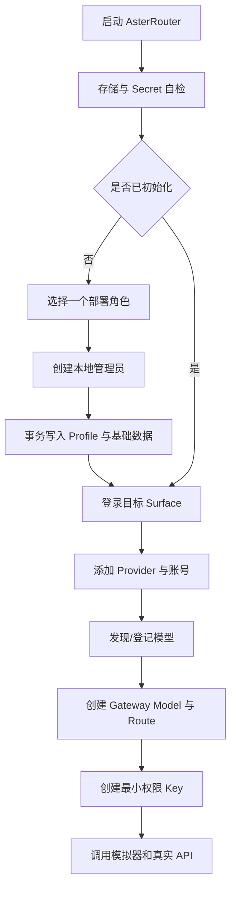
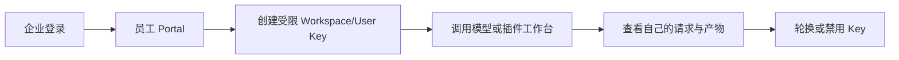
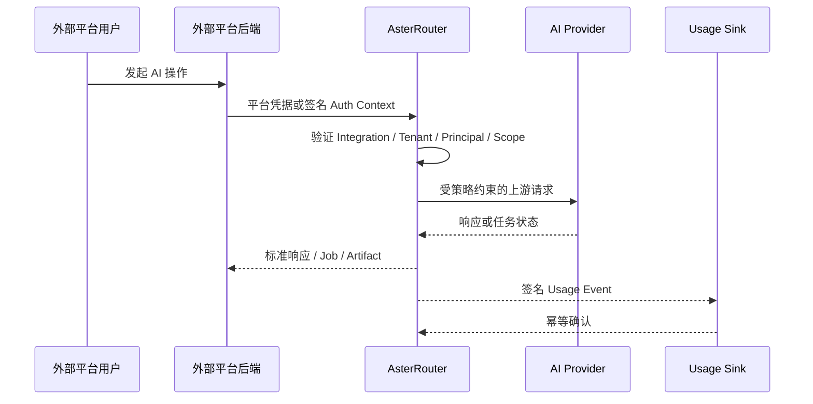
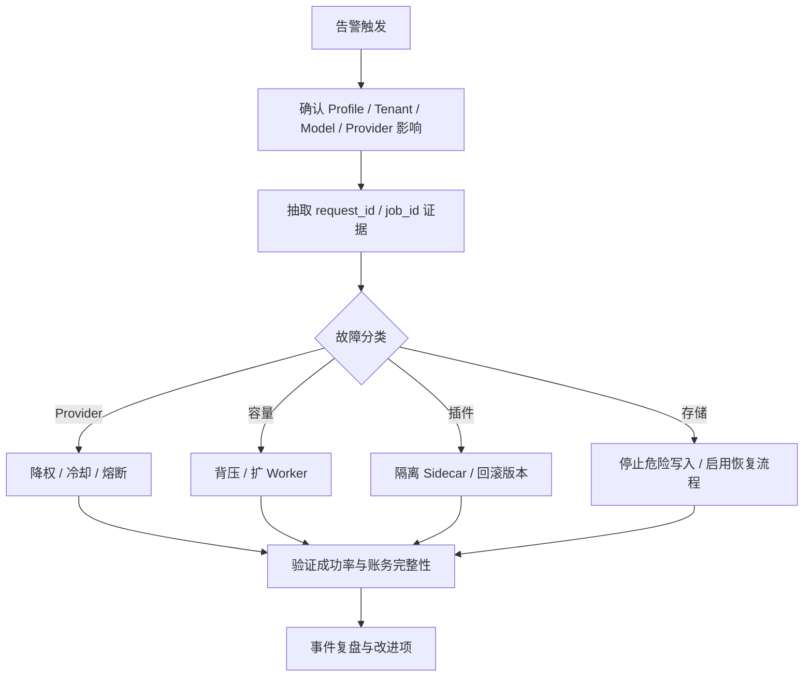

# 角色与用户旅程

## 1. 角色模型

产品角色与权限角色必须分开：产品角色描述用户目标，权限角色描述在特定 Scope 中可执行的操作。一个自然人可同时是企业管理员、插件开发者和某个客户的观察者，但每次操作只在明确的当前上下文中授权。

| 产品角色 | 主要入口 | 核心任务 | 禁止默认获得 |
| --- | --- | --- | --- |
| 实例所有者 | Setup / System Admin | 安装、恢复、升级、License、根信任 | Provider Secret 明文回显 |
| 企业管理员 | Enterprise Admin | 用户、部门、策略、模型、预算、审计 | AsterCloud 商业后台权限 |
| AI 平台工程师 | Admin / API | Provider、账号、模型、Route、容量、故障处理 | 客户财务调整权限 |
| 企业员工 | Portal / 插件工作台 | 创建个人或项目 Key、调用授权模型 | 其他部门成本和账号信息 |
| Relay 运营者 | Operator | 客户、套餐、账号池、风险和用量 | 企业 Profile 的员工目录 |
| Relay 客户 | Customer | 余额、Key、账单、通知和用量 | 上游账号与采购成本 |
| 平台集成管理员 | Platform | Tenant、Principal、外部鉴权、Usage Sink | 外部平台终端用户 Session |
| 应用开发者 | Gateway API / Portal | 创建/轮换 Key、调用、查 Job/Artifact | Provider Secret 与内部路由拓扑 |
| 插件开发者 | AsterCloud Developer | 项目、上传、扫描、审核和发布 | 任意客户实例数据 |
| AsterCloud 运营 | AsterCloud Admin | 目录、授权、公告、官方服务 | 私有实例的远程启停权限 |
| SRE / 安全审计 | Admin / Observability | SLO、事件、诊断、应急与证据 | 无审批的敏感内容导出 |

## 2. 首次安装旅程

验收要求：

- Profile 提交具备幂等和并发保护，失败后可恢复，不产生半初始化状态。
- 生产模式拒绝空管理员密码、临时 Secret 和 Memory Repository。
- 首次成功调用前必须能看到 Provider 健康、Route 决策与 Usage 记录。
- Setup 完成后入口关闭；重新初始化必须走明确的恢复流程。

## 3. 企业 AI 平台旅程

### 3.1 管理员

1. 接入本地身份或 OIDC，建立用户、部门、组织组和角色绑定。
2. 配置 Provider Connection 与多个 Provider Account，Secret 只提交不回显。
3. 同步账号模型清单，发布稳定 Gateway Model 和 Model Route。
4. 创建治理策略，限定模型、模态、操作、预算、速率、网段和 Artifact Policy。
5. 通过 Gateway Simulator 解释某个用户或 Key 的最终策略和 Route。
6. 查看 Usage、Cost Allocation、Trace、Alert 和 Audit。

### 3.2 员工与应用

员工不能看到完整 Provider 列表、账号 Secret、其他部门调用明细或采购价。应用 Key 应优先归属 Service/Gateway Principal，而不是绑定会离职的自然人。

## 4. Relay Operator 旅程

### 4.1 运营者

1. 创建客户与客户分组，分配套餐、额度和路由组。
2. 维护多 Provider Account 的优先级、权重、并发、余额和冷却规则。
3. 发布客户可见模型、价格和使用限制。
4. 监控账号健康、余额耗尽、客户风险、用量和毛利趋势。
5. 对充值、兑换和账务调整执行职责分离与审计。

### 4.2 客户

1. 登录 Customer Surface，查看余额、套餐与可用模型。
2. 创建 Customer/Service Key，设置模型与速率限制。
3. 调用 API，按请求、模型和时间查看 Usage 与费用。
4. 使用兑换码或受支持支付通道充值。
5. 在余额、异常用量和服务事件发生时收到通知。

兼容约束：Relay Profile 现有客户、套餐、余额模型属于 `COMPAT/CURRENT` 的 Profile 内事实，不得被 Platform Profile 或插件复用成通用商业内核。

## 5. 外部平台集成旅程

外部平台继续拥有用户登录、套餐和业务 Session。AsterRouter 只保存稳定的 Tenant/Principal/Integration 引用和必要审计，不复制外部用户档案。

## 6. 多模态创作旅程

| 阶段 | 用户动作 | Core 责任 | 插件责任 |
| --- | --- | --- | --- |
| 选择能力 | 在图片/视频工作台选择模板与参数 | 暴露授权模型和能力 | 提供场景 UI、校验 Schema |
| 提交 | 上传输入、选择 Direct/Durable | 鉴权、配额、幂等、Artifact Admission | 构造标准请求，不持有 Provider Secret |
| 执行 | 等待流式结果或 Job | Route、容量、Attempt、回调/轮询 | Provider Adapter 映射私有协议 |
| 交付 | 预览、下载或投递客户存储 | Artifact 权限、保留、交付和删除 | 展示结果与业务工作流 |
| 结算 | 查看消耗 | Usage、价格快照、账本、审计 | 只展示授权后的 Core 事实 |

## 7. 插件开发者旅程

1. 在 AsterCloud 创建 Developer Account、Organization 和 Plugin Project。
2. 使用版本化 manifest 与 SDK 开发，声明 Runtime、Surface、Capability、Permission 和 Schema。
3. 本地运行契约测试，生成可复现包、Checksum、SBOM 和测试证据。
4. 通过分片上传提交包，服务端校验摘要并创建 Review。
5. 自动执行恶意代码、Secret、依赖、权限、Schema 和兼容性扫描。
6. 审核通过后生成签名版本与平台包，进入灰度 Channel。
7. 观察安装、崩溃和兼容性聚合信号；发布修复或安全公告。

开发者永远不能获得客户实例的 Provider Secret、Prompt、Response 或 Usage 明细。诊断信息默认只有匿名版本、平台、错误码和显式上传的脱敏包。

## 8. AsterCloud 客户旅程

| 场景 | 在线路径 | 离线路径 |
| --- | --- | --- |
| 实例注册 | 实例生成身份并向 AsterCloud 激活 | 导出请求文件，在联网设备完成签发 |
| License | 在线获取签名 Entitlement Snapshot | 下载签名 License 文件并本地导入 |
| 插件安装 | 同步 Catalog、下载签名 Package | 导入离线 Package 与 Catalog Snapshot |
| 官方 Feed | 定时拉取签名/加密 Feed | 导入离线 Feed 包 |
| 安全公告 | 在线同步并匹配本地版本 | 导入公告与撤销清单 |

## 9. SRE 事件旅程

## 10. 职责分离

| 操作 | 发起者 | 复核者 |
| --- | --- | --- |
| 修改生产价格或手工账务 | 运营/财务 | 独立财务或管理员 |
| 导入 Provider Secret | 平台工程师 | 安全或授权管理员 |
| 大范围 Route 变更 | 平台工程师 | SRE |
| 安装高权限第三方插件 | 插件管理员 | 安全管理员 |
| 发布/撤销官方插件 | 目录运营 | 发布签名责任人 |
| 导出敏感诊断 | 客服/SRE | 安全审批，限时授权 |

## 11. 体验验收原则

- 每个阻塞状态必须告诉用户缺少哪个可操作前置条件，不生成假数据。
- Secret、Key 和恢复码只显示一次，后续只展示指纹或提示。
- 长任务页面刷新后可恢复，不依赖浏览器内存作为事实源。
- 高风险动作先展示影响范围，再明确确认，完成后提供审计 ID。
- 用户只看到其角色完成任务所需信息，不以“高级模式”暴露系统内部秘密。
