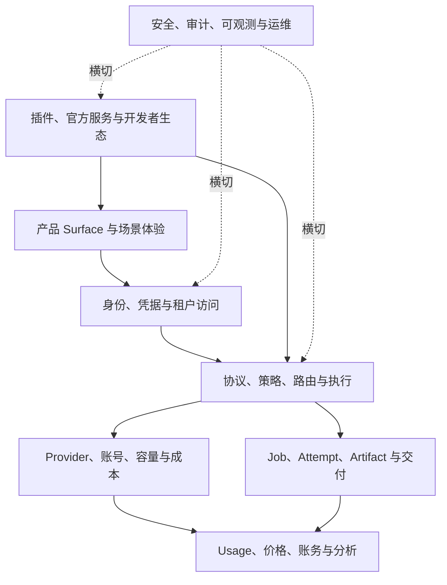

# 业务能力与功能地图

## 1. 能力分层



## 2. 能力总表

| 域 | 能力 | 当前状态 | 目标归属 | 优先级 |
| --- | --- | --- | --- | --- |
| 产品面 | Setup 与单 Profile 初始化 | `CURRENT` | AsterRouter Core | P0 |
| 产品面 | Admin/Portal/Operator/Customer/Platform Surface | `CURRENT` | AsterRouter Core | P0 |
| 产品面 | 插件前端贡献与场景工作台 | `CURRENT` | Core Host + Plugin | P0 |
| 身份 | 本地账号、OIDC、TOTP、角色绑定 | `CURRENT` | AsterRouter Core | P0 |
| 身份 | Workspace/User/Customer/Service Key | `CURRENT` | AsterRouter Core | P0 |
| 身份 | Platform Tenant、Principal、External Auth | `CURRENT` | AsterRouter Core | P0 |
| 身份 | 多组织 Membership 与 ServiceAccount 收敛 | `TARGET` | AsterRouter Core | P1 |
| Gateway | OpenAI-compatible 文本、图片、音频、Realtime | `CURRENT` | AsterRouter Core | P0 |
| Gateway | Durable 图片/视频任务与 Artifact | `CURRENT` | AsterRouter Core | P0 |
| Gateway | 公开协议兼容矩阵与版本策略 | `TARGET` | AsterRouter Core | P0 |
| 供应 | Provider、Account、模型同步、Route | `CURRENT` | AsterRouter Core | P0 |
| 供应 | 健康、熔断、冷却、RPM/TPM/并发容量 | `CURRENT` | AsterRouter Core | P0 |
| 供应 | 跨副本原子容量与可解释成本优化 | `CURRENT/TARGET` | AsterRouter Core | P0 |
| 任务 | 公平队列、Lease、取消、回调/轮询协调 | `CURRENT` | AsterRouter Core | P0 |
| 任务 | DLQ 运维面与自动恢复证明 | `TARGET` | AsterRouter Core | P1 |
| 产物 | Local/S3、临时/托管/客户 Sink 策略 | `CURRENT` | AsterRouter Core | P0 |
| 产物 | 跨存储迁移与删除证明导出 | `TARGET` | AsterRouter Core | P1 |
| 计量 | Usage 维度、价格规则、评估、Ledger | `CURRENT` | AsterRouter Core | P0 |
| 计量 | 供应商账单导入与差异对账 | `TARGET` | Core + 财务集成插件 | P1 |
| FinOps | Effective Pricing、采购比价、节省证据 | `CURRENT/TARGET` | Core + MonitorPrice | P1 |
| 插件 | 签名目录、包、安装、Sidecar、Host API | `CURRENT` | Core + AsterCloud | P0 |
| 插件 | SDK、协议版本、审核证据、SBOM、撤销 SLA | `TARGET` | Core + AsterCloud | P0 |
| 官方服务 | Catalog、License、Developer Review、Feed | `CURRENT` | AsterCloud | P0 |
| 官方服务 | 高可用签发与密钥轮换演练 | `TARGET` | AsterCloud | P0 |
| 运维 | 健康、备份、诊断、审计、告警 | `CURRENT` | AsterRouter Core | P0 |
| 运维 | 标准 SLO、OTel、HA/DR 自动演练 | `TARGET` | Core + 运行平台 | P1 |

## 3. Core 必须内建的能力

一项能力满足任一条件，就必须由 Core 控制最终裁决：

- 影响认证、授权、租户隔离或 Provider Secret。
- 影响 Route、容量、重试提交点或请求正确性。
- 产生 Usage、价格快照、账务或成本事实。
- 改变 Job、Attempt、Artifact 的权威状态。
- 是所有 Profile 都需要的稳定公共契约。
- 插件故障会造成越权、重复执行、漏计费或不可恢复数据损坏。

因此 Credential 校验、Policy、Scheduler、Usage Normalize、Billing Settlement、Artifact ACL、插件签名校验和审计不可插件化。

## 4. 适合插件化的能力

| 插件类型 | 适合内容 | Core 守卫 |
| --- | --- | --- |
| 场景工作台 | 图片、视频、Prompt、行业工作流 UI | 同源资源、CSP、Surface、会话 Scope |
| Provider Adapter | 私有请求、回调、状态、错误和 Usage 映射 | Secret 临时注入、Endpoint Allowlist、标准结果验证 |
| 数据服务 | 价格、信任、风险、能力 Feed 的本地消费 | 签名、加密、Schema、TTL、License |
| 通知 | Webhook、Email、IM、事件转换 | 脱敏事件、目标 Allowlist、重试与审计 |
| 报表/导出 | 聚合分析、客户格式和 BI 投递 | 授权查询、行数/时间限制、不可直连 DB |
| Artifact Sink | S3/R2/OSS/客户存储适配 | Tenant Binding、Secret Vault、校验和、交付状态 |
| Entitlement Adapter | 外部平台权益确认 | 有界超时、缓存、签名 Context、Core 硬上限 |

首阶段不开放通用热路径 Filter 插件。未来若引入 WASM/策略包，也只能处理有界纯函数输入，不能访问网络、Secret 或数据库。

## 5. AsterCloud 能力地图

```text
Identity & Access
  Principal / Role / Permission / API Credential / Refresh Session
Commerce
  Customer / Product / Plan / SKU / License / Entitlement / Grant / Subscription
Catalog & Supply Chain
  Plugin / Version / Manifest / Compatibility / Package / Snapshot / Core Release / Advisory
Developer Platform
  Account / Organization / Project / Upload / Review / Scan / Decision
Official Services
  Service / Version / Schema Compatibility / Signed Feed
Provider Intelligence
  Provider / Endpoint / Probe Node / Probe Task / Probe Request
Fulfillment
  Redeem Batch / Code / Redemption / Worker Job / License Activation
```

AsterCloud 的能力只通过版本化、可签名、可缓存的 API 或离线文件进入客户环境。它不提供远程执行 AsterRouter 管理命令的控制通道。

## 6. Profile Bundle

| 能力包 | Personal | Relay Operator | Enterprise | Platform |
| --- | --- | --- | --- | --- |
| Core Gateway / Provider / Model / Route | 必选 | 必选 | 必选 | 必选 |
| 本地用户与 Key | 必选 | 必选 | 必选 | 管理员必选 |
| 客户、套餐、余额 | 不启用 | 必选 | 不启用 | 不启用 |
| 部门、组织组、成本分摊 | 可选 | 不启用 | 必选 | 不启用 |
| Platform Tenant / External Auth / Usage Sink | 不启用 | 不启用 | 可选集成 | 必选 |
| 多模态 Job / Artifact | 可选 | 可选 | 可选 | 可选 |
| 插件 Host | 必选 | 必选 | 必选 | 必选 |
| AsterCloud 连接器 | 可禁用 | 可禁用 | 可禁用 | 可禁用 |

Bundle 只决定启用和导航，不删除共享领域代码。未启用能力不得暴露路由、后台任务或默认权限。

## 7. 能力成熟度门槛

| 等级 | 定义 | 进入下一等级条件 |
| --- | --- | --- |
| Experimental | 契约可能变化，仅测试环境 | 领域 owner、Schema、错误码、单元测试明确 |
| Preview | 可灰度使用，不承诺长期兼容 | 集成测试、迁移、观测、回滚、文档完成 |
| GA | 公开稳定契约 | 发布验收、SLO、升级兼容、安全审查完成 |
| Deprecated | 有替代方案，停止新增调用方 | 迁移工具、调用指标、移除版本明确 |
| Removed | 代码与数据路径退出 | 引用扫描、迁移验证、发布说明完成 |

## 8. 需求归属规则

新增能力必须先回答：

1. 谁是领域 owner 和事实源？
2. 它属于所有 Profile 的 Core 不变量，还是某类场景扩展？
3. 故障时是否允许影响 Gateway 热路径？
4. 需要哪些 Secret、网络、存储和租户权限？
5. 数据如何迁移、保留、导出和删除？
6. 如何计量、审计、观测和回滚？
7. AsterCloud 离线时是否仍能工作？

无法回答这些问题的需求不得直接进入实现。

## 9. 退出与收敛

- `backend/internal/controlplane` 继续作为 Core 领域服务边界，按领域拆 Repository，不再向单一大 Service 堆积跨域事务。
- Profile 专属商业功能保留明确包和路由前缀，不向 Gateway Core 模型渗透。
- Provider 私有差异进入 Adapter；业务侧重复代理标记 `DEPRECATED`。
- 插件专属表或文件通过 Host API 管理；禁止新增插件直连 Core PostgreSQL 的实现。
- 历史 roadmap 只保留决策背景；已采纳目标迁入本目录，避免多版目标并存。
