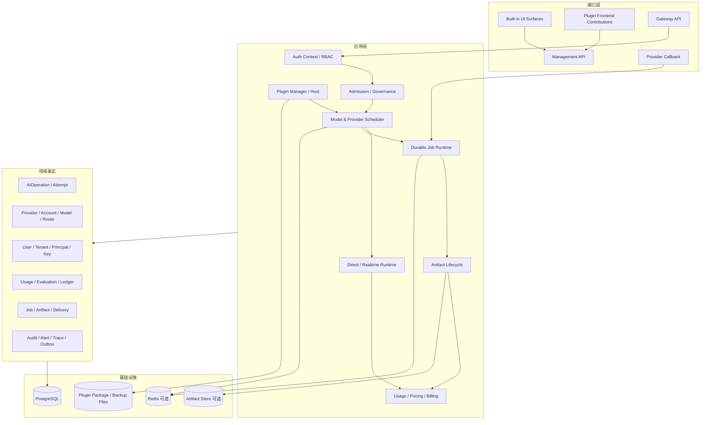
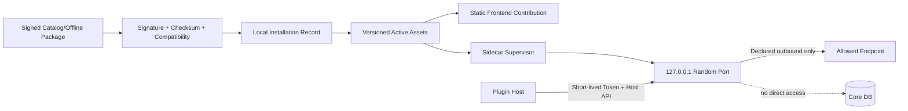
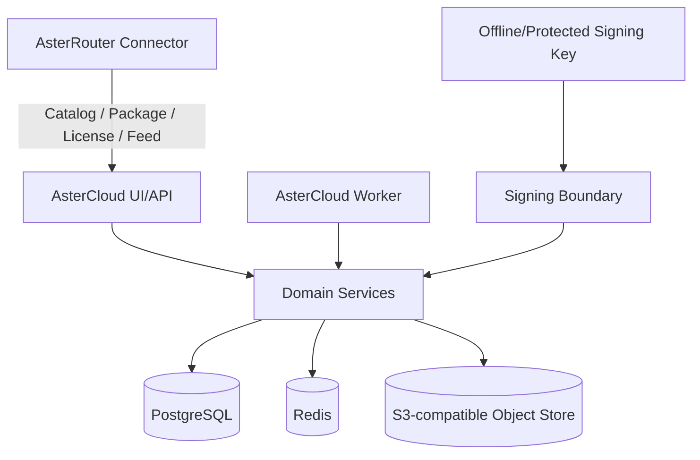
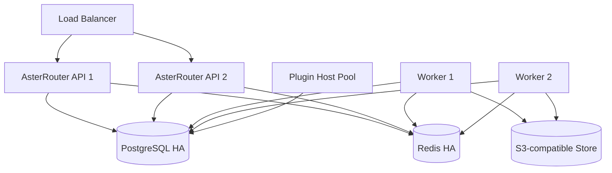

# 总体与部署架构

## 1. 架构目标

- 单机可用、按角色扩展、多副本一致，三种拓扑不改变业务语义。
- 数据面不依赖 AsterCloud、前端或插件市场在线可用。
- Direct、Realtime、Durable 共享身份、策略、路由、Usage 和审计主链路。
- 插件运行时与 Core 故障隔离；插件不能直接拥有 Core 存储。
- 每个状态变化有权威事实、幂等键、版本或租约，并可在故障后恢复。

## 2. 逻辑架构



依赖方向始终从接口、应用到领域端口和基础设施适配器。Provider Adapter、存储 Driver 和插件 Runtime 实现接口，不允许领域模型依赖某个具体 Provider、Redis 客户端或插件业务协议。

## 3. 请求流水线

```text
Protocol Edge
  -> Credential Extraction
  -> Canonical Auth Context
  -> Scope / Tenant / Policy
  -> Request Normalize & Capability Requirement
  -> Idempotency / Admission / Billing Hold
  -> Gateway Model & Route Candidates
  -> Provider Capacity Permit
  -> AIOperation / AIAttempt
  -> Provider Adapter
  -> Response / Job / Artifact
  -> Usage Normalize
  -> Pricing / Billing / Cost / Outbox
  -> Trace / Audit / Usage Sink
```

提交点必须按协议定义：响应头或首个流式事件提交后，不允许切换 Provider 拼接响应；异步任务在 Provider 接受并返回任务标识后，不允许盲目重放创建。

## 4. 进程角色

| 角色 | 职责 | 可扩缩性 | 不应承担 |
| --- | --- | --- | --- |
| `all-in-one` | API、控制面、Worker、Plugin Host | 单机/小规模 | 大规模多副本生产 |
| `api` | Gateway/Management API、Direct、Realtime | 无状态优先，水平扩展 | 长轮询和大规模异步消费 |
| `worker` | Durable Job、回查、Outbox、Artifact、Retention | 按归一工作量扩展 | 公开管理 UI |
| `plugin-host` | Sidecar Supervisor 与调用代理 | 按实例/插件隔离 | Gateway Core 最终裁决 |
| `migrate` | 显式 Schema 迁移 | 单例作业 | 常驻服务 |

`TARGET` 中可由同一二进制通过 Role 参数启动不同角色。单机模式组合角色，不产生另一套实现。

## 5. 存储职责

| 存储 | 用途 | 一致性要求 | 故障策略 |
| --- | --- | --- | --- |
| PostgreSQL | 所有业务权威事实、状态机、审计、Outbox | 强事务、唯一约束、乐观版本 | 不确定写入停止危险重试，恢复后对账 |
| Redis | Ready Index、队列通知、容量、亲和、限流、缓存 | 原子脚本/租约，可重建 | 降级到 Repository 或暂停 Durable 派发 |
| Artifact Store | 输入/输出媒体内容 | 元数据与对象校验和关联 | 对象失败不伪造 Ready，进入可重试状态 |
| Plugin Active/Cache | 已验签包和运行资产 | 与安装记录对账 | 从 Package Cache 或离线包恢复 |
| Backup/Diagnostic | 恢复包与脱敏诊断 | 校验和、访问控制、保留期 | 不进入服务热路径 |

## 6. 插件架构



Sidecar 每次启动使用新 Token 和随机本机端口。Host 在调用时注入最小必要上下文，过滤 Hop-by-hop Header，限制请求/响应大小、超时和并发。Sidecar 崩溃按上限退避，不得拖垮 Core。

## 7. AsterCloud 架构



- PostgreSQL 保存身份、商业、目录、审核、服务和签名操作事实。
- Object Store 保存插件包、Catalog Snapshot、离线 License 与 Feed 资产。
- Redis 用于队列、幂等加速和短期协调，不保存唯一商业事实。
- 签名私钥从文件或受保护密钥服务加载，不写数据库，不出现在应用日志。
- API 与 Worker 分离；迁移为显式或启动前受控操作。

## 8. 单机生产拓扑

```text
Reverse Proxy / TLS
  -> AsterRouter all-in-one :8080
       -> PostgreSQL
       -> Redis (启用 Durable 多实例能力时推荐)
       -> Local or S3 Artifact Store
       -> Local Plugin Sidecars
```

最低生产要求：持久 PostgreSQL、稳定 `secret-key`、TLS 终止、备份、非示例管理员凭据、关闭 Demo Mode。Memory Repository 只允许源码开发和隔离测试。

## 9. 高可用拓扑



多副本前置条件：

- Session、限流、容量、亲和和队列没有进程内唯一状态。
- Job、Attempt、Outbox 和 Artifact 使用租约、状态版本与幂等约束。
- Plugin Sidecar 是否按节点运行必须由插件类型声明；不可多副本执行的任务需要领导租约。
- Realtime Session 明确连接归属，断开不隐式跨节点拼接。
- 数据库迁移使用单独 Job，应用副本不并发执行破坏性迁移。

## 10. 网络与信任区

| 区域 | 入站 | 出站 | 关键控制 |
| --- | --- | --- | --- |
| Public Gateway | `/v1/*` | Provider、对象存储 | WAF、TLS、大小/速率限制 |
| Management | `/api/v1/*` | DB、Redis、AsterCloud 可选 | 内网/VPN、RBAC、MFA、CSRF |
| Provider Callback | 专用 callback 路由 | DB/Queue | Provider 签名、Nonce、重放保护 |
| Plugin Sidecar | 仅本机 Host 调用 | Manifest Allowlist | 短期 Token、超时、无 Core DB 网络 |
| AsterCloud | Public API / Admin | Object Store、邮件等 | 租户授权、签名边界、审计 |

## 11. 可用性降级矩阵

| 故障 | 数据面行为 | 管理面行为 | 恢复要求 |
| --- | --- | --- | --- |
| AsterCloud 不可达 | 使用有效本地 Catalog/License/Feed | 显示陈旧度，停止在线安装 | 恢复后验签增量同步 |
| Redis 不可达 | 单副本可降级；多副本暂停依赖原子协调的派发 | 告警并显示受影响能力 | 从 PostgreSQL 重建索引 |
| Artifact Store 不可达 | 文本可继续；需产物操作失败或排队 | 禁止显示伪 Ready | 校验后重试交付 |
| 某 Sidecar 崩溃 | 隔离该插件/Adapter，Route 选择其他候选 | 显示退避与错误 | 健康检查后恢复 |
| PostgreSQL 不可写 | 拒绝产生新权威状态的请求 | 只读诊断 | 恢复、对账、不盲重放 |
| Provider 故障 | 熔断、冷却、受控重试/降级 | 记录 reason code | 探测通过后半开恢复 |

## 12. 架构验收

- 断开 AsterCloud 后执行文本、图片和已安装插件的离线回归。
- 强制杀死 Worker/Sidecar/API，验证 Job、Lease、Outbox 和 Supervisor 恢复。
- 在多副本并发下验证同一幂等键不重复创建 Provider 任务或账务分录。
- 验证 Redis 清空后 Ready Index 和可恢复队列能从 PostgreSQL 重建。
- 验证 Artifact Store 超时、部分写入、校验失败和删除失败状态可观测。
- 验证所有 Secret 不出现在 API、前端、日志、诊断包和插件数据目录。

## 13. 相关文档

- [核心流程与时序](./05-核心流程与时序.md)
- [数据库与事件设计](./15-数据库与事件设计.md)
- [多实例部署与容灾设计](./19-多实例部署与容灾设计.md)
