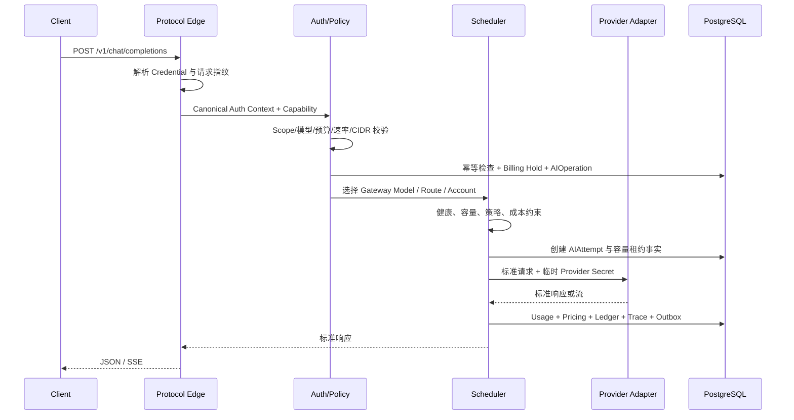
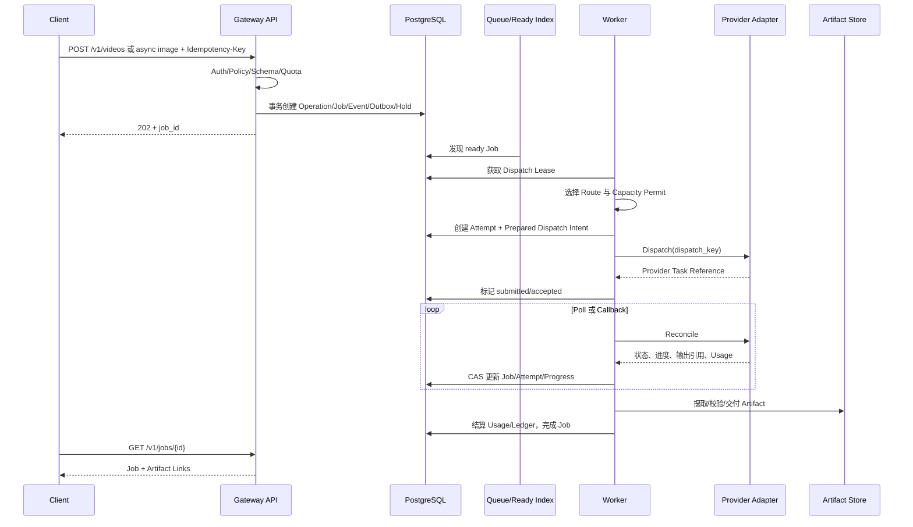
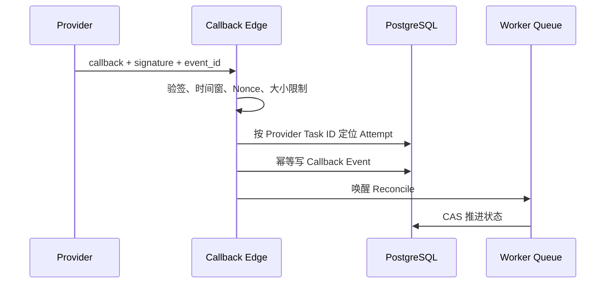
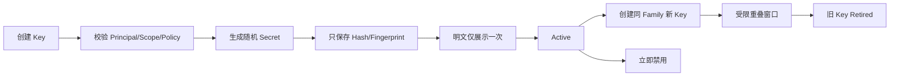
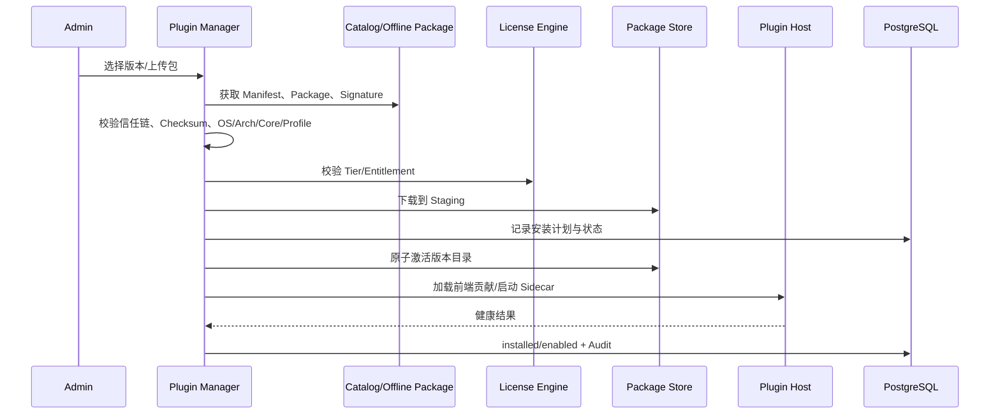
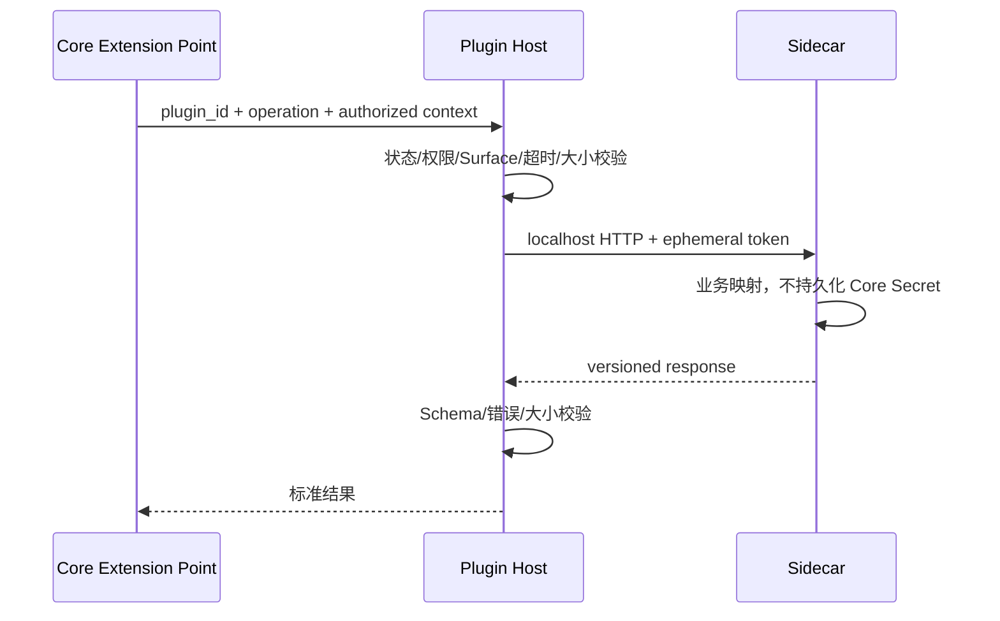
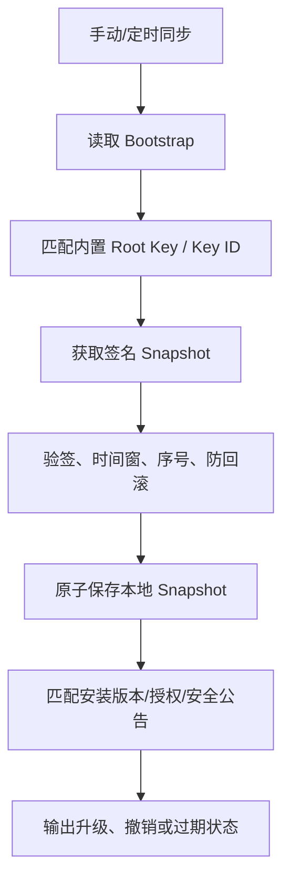

# 核心流程与时序

## 1. 流程设计原则

- 先建立可信身份与约束，再选择模型和 Provider。
- 先持久化必要的幂等、预扣和 Operation 事实，再执行不可逆外部副作用。
- Provider 接受请求、响应提交、账务结算和 Artifact Ready 都是独立提交点。
- 重试只发生在可证明安全的边界；状态未知时先 Reconcile，不盲目重发。
- 所有异步参与者至少一次执行，依靠唯一约束、版本和幂等键获得业务上的恰好一次效果。

## 2. Direct 文本请求



关键规则：

1. Credential 只允许一个传输来源；冲突凭据拒绝，不猜测优先级。
2. `model` 解析为稳定 Gateway Model，再根据能力和策略筛 Route。
3. Provider Secret 在调用边界解密，Adapter 不持久化。
4. SSE 首个响应事件发出后即视为已提交，后续 Provider 失败不能换源拼接。
5. 客户断开不代表 Provider 一定停止；Core 仍需按已知 Usage 结算并记录中断。

## 3. Durable 多模态任务



### 3.1 四层幂等

| 层 | 键 | 冲突处理 |
| --- | --- | --- |
| 客户创建 | Tenant + Credential + Idempotency Key | 同指纹返回原 Job；不同指纹返回冲突 |
| 队列派发 | Job ID + Dispatch Version | 只有持有有效 Lease 的 Worker 可推进 |
| Provider 创建 | Attempt Dispatch Key | Adapter 必须透传上游幂等键或先 Reconcile |
| 结果结算 | Attempt + Usage Version / Provider Event ID | 唯一约束拒绝重复 Usage 与 Ledger |

### 3.2 状态未知

网络超时发生在请求可能已到达 Provider 时，Attempt 进入 `dispatch_unknown` 语义。Worker 只能：

- 使用 Provider 幂等查询确认已创建并绑定任务；
- 证明未创建后安全重发；
- 无法证明时进入人工处置或等待窗口，不以超时等同失败。

## 4. Provider Callback



Callback 只提供事实输入，不直接绕过状态机完成 Job 或写 Ledger。Poll 与 Callback 可并存，但由同一状态版本协调。

## 5. Realtime 会话

```text
HTTP Upgrade -> Credential/Auth -> Session Admission -> Route/Capacity
-> Upstream WebSocket -> 双向帧代理 -> Usage 聚合 -> Session Close/Settlement
```

- Session 在握手前完成身份、模型和并发校验。
- 一个客户端连接对应一个明确的上游 Attempt；不可在会话中无提示换 Provider。
- 帧大小、空闲超时、总时长和背压有硬限制。
- Usage 可增量采集，但最终以 Session 关闭或 Provider 最终事件结算。
- 进程崩溃后的连接不透明迁移，客户端按可重试错误重新建立会话。

## 6. API Key 创建与轮换



轮换操作记录 `rotation_family_id`、替代关系和截止时间。禁用与安全撤销不等待重叠窗口；缓存必须通过版本/事件近实时失效。

## 7. 插件安装与启用



安装和启用分离。安装失败不污染 Active；启用失败保留安装资产和诊断；更新前保留上一可用版本用于回滚。

## 8. Sidecar 调用



Provider Adapter Sidecar 获得的 Secret 只存在于当前调用内存，日志必须脱敏。Host 不解析插件私有业务，但必须验证统一 Envelope、协议版本、调用权限和资源限制。

## 9. Catalog 与 License 同步



同步失败保留最后有效快照并显示陈旧度。签名错误、序号回退或未知密钥不得覆盖本地有效状态。

## 10. Usage Sink 投递

1. 结算事务同时写 Usage、Ledger 和 Outbox。
2. Worker 从 Outbox 生成目标 Sink 的 Delivery Event。
3. Payload 使用稳定版本、最小字段和目标独立签名。
4. HTTP 超时或非成功响应按退避重试，不阻塞 Gateway 响应。
5. 接收方以 `event_id` 幂等；超过最大次数进入 Dead Letter。
6. 管理员可查看、重放单条投递，不能修改原始 Usage。

## 11. Artifact 删除

```text
ready/delivered/expired
  -> delete_requested
  -> deleting
  -> deleted | delete_failed
```

删除元数据前先删除或确认外部对象状态；`deleted` 保留对象标识摘要、策略、时间、操作者和结果证据，不保留可访问内容引用。法律保留或审计冻结优先于常规 TTL。

## 12. 流程级验收

- 在每个外部调用前后注入进程崩溃，验证无重复 Provider 任务和账务。
- Direct 流式首包前允许安全换源，首包后只结束并记录错误。
- Callback 重放、乱序和 Poll 竞态不回退状态版本。
- 插件更新中断后只能是旧版本继续可用或新版本明确失败，不出现混合资产。
- License/Catalog 回滚攻击、过期和断网行为符合 fail-closed 与离线窗口策略。
