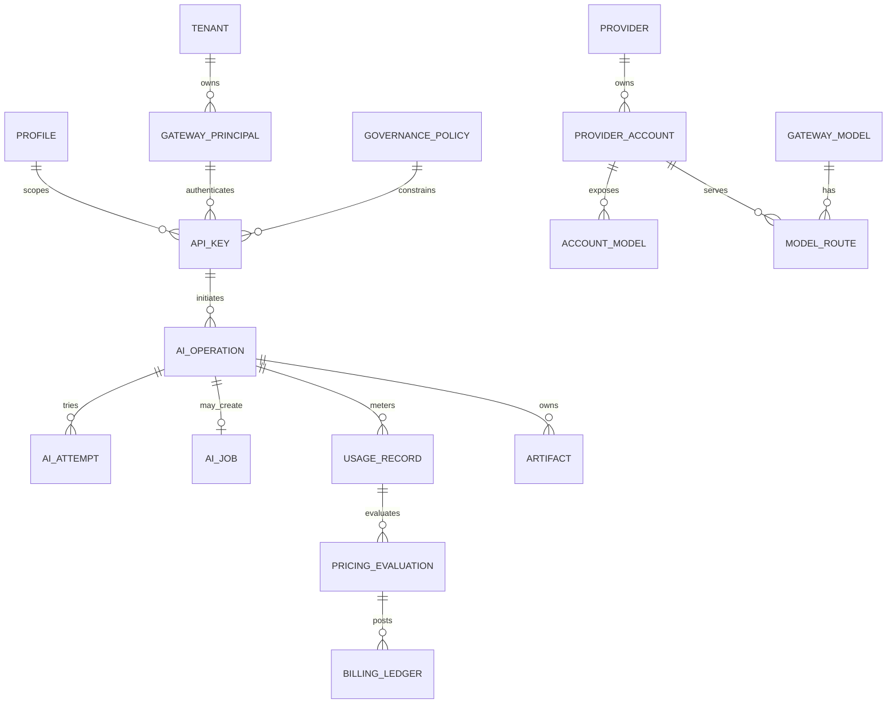

# 领域模型与数据归属

## 1. 限界上下文

| 上下文 | 核心实体 | 事实源 | Owner |
| --- | --- | --- | --- |
| Installation | Instance、Profile、Runtime Config、Backup | AsterRouter PostgreSQL/配置 | Core System |
| Identity & Access | User、Identity、RoleBinding、Tenant、Principal、APIKey | AsterRouter PostgreSQL | Core IAM |
| Supply | Provider、ProviderAccount、AccountModel、GatewayModel、ModelRoute | AsterRouter PostgreSQL | Core Supply |
| Governance | GovernancePolicy、RiskBlock、Quota、CapacityPermit | AsterRouter PostgreSQL/Redis 协调 | Core Policy |
| AI Execution | AIOperation、AIAttempt、AIJob、RealtimeSession | AsterRouter PostgreSQL | Core Runtime |
| Metering & Finance | UsageRecord、PricingRuleVersion、Evaluation、Hold、Ledger | AsterRouter PostgreSQL | Core FinOps |
| Artifact | Artifact、ArtifactEvent、SinkDestination、Delivery | AsterRouter PostgreSQL + Object Store | Core Artifact |
| Plugin Runtime | Plugin、Config、PackageCache、Installation、Token、RuntimeState | AsterRouter PostgreSQL + 本地资产 | Core Plugin Host |
| Official Commerce | Customer、Product、Plan、SKU、License、Entitlement、Grant | AsterCloud PostgreSQL | AsterCloud Commerce |
| Official Catalog | Plugin、Version、Manifest、Compatibility、Package、Advisory | AsterCloud PostgreSQL + Object Store | AsterCloud Catalog |
| Developer Platform | Developer、Organization、Project、Upload、Review、Scan | AsterCloud PostgreSQL | AsterCloud Developer |
| Official Intelligence | Service、Feed、Provider、Endpoint、Probe | AsterCloud PostgreSQL + Object Store | AsterCloud Service |

同名实体在不同上下文中必须有不同含义。例如 AsterCloud `Plugin` 是可发布目录条目，AsterRouter `Plugin` 是本地可用能力与安装状态；二者通过稳定 `plugin_id + version + digest` 对应，不共享数据库。

## 2. 核心领域关系



## 3. 身份模型

### 3.1 管理面身份

- `WorkspaceUser`：AsterRouter 本地自然人投影，承担登录与个人资料。
- `AuthIdentity`：密码、OIDC 或其他登录身份与 User 的绑定。
- `RoleBinding`：Principal 在 Profile/资源 Scope 中的权限绑定。
- `Department` / `OrganizationGroup`：Enterprise 的组织与治理维度，不等同 Tenant。

### 3.2 数据面身份

- `PlatformTenant`：Platform Profile 的外部客户边界。
- `GatewayPrincipal`：Service、Developer 或 Integration 等稳定机器/业务主体。
- `APIKeyRecord`：Credential，保存 Hash、Fingerprint、Scope 和约束，不是业务主体本身。
- `ExternalAuthIntegration`：验证外部平台签名 Context/JWT 的信任配置。
- `CanonicalAuthContext`：每次请求解析出的不可持久 Session，包括 Profile、Tenant、Principal、Credential Source、Scope 和策略引用。

目标态中自然人、组织、机器主体与 Credential 分离。移除用户不应破坏 Service Principal 的生产 Key；禁用 Principal 必须使其所有 Credential 失效。

## 4. 供应模型

```text
Provider Connection
  -> Provider Account
      -> Account Model Inventory
      -> Runtime Settings / Model Mapping
Gateway Model
  -> Model Route
      -> Provider Account + Upstream Model + Adapter
```

| 实体 | 含义 | 不应承载 |
| --- | --- | --- |
| Provider | 协议/供应商入口和 Base URL | 单个客户 Key 或余额 |
| Provider Account | 一组 Secret、容量、健康、调度和模型清单 | 对外稳定模型名 |
| Gateway Model | 客户可见稳定模型与能力契约 | Provider Secret |
| Model Route | Gateway Model 到账号/上游模型的候选关系 | 客户账单总价 |
| Provider Adapter | 请求/响应/错误/Usage 的协议映射 | Route 最终决策 |

## 5. 执行模型

### 5.1 AIOperation

所有调用的顶层事实，至少包含：Owner、Credential Source、请求指纹、协议、操作、模态、Lane、模型、Artifact Policy、状态和时间。

### 5.2 AIAttempt

一次具体 Provider 尝试，保存 Provider、Account、Adapter、Route、Upstream Model、Dispatch 状态和 Provider Task 引用。一次 Operation 可以有多个 Attempt，但只有符合提交点规则的 Attempt 能产生最终响应和结算。

### 5.3 AIJob

Durable Lane 的可恢复执行单元。Job 与 Operation 一对一或明确关联，拥有 Queue、Lease、Cancel、Progress 和终态版本。Job 不是 Provider Task；Provider Task 归属于 Attempt。

## 6. Usage 与财务模型

| 实体 | 事实类型 | 可变性 |
| --- | --- | --- |
| UsageRecord | 标准技术用量及维度 | 追加版本，不原地篡改已结算事实 |
| PricingRuleVersion | 价格表达式与适用范围 | Draft 可改，Published 不变 |
| PricingEvaluation | 某 Usage 在某规则版本下的结果 | 不可变，可通过新评估纠正 |
| BillingHold | 请求前预算/余额预留 | 状态机推进，释放或结算 |
| BillingLedgerEntry | 客户应收、成本或调整分录 | 只追加，纠错使用冲正 |
| EffectivePriceObservation | 实际采购/成本观测 | 带来源、置信度和时间窗 |
| SavingsEvidence | 相对基线的节省证明 | 关联决策、基线和实际结果 |

金额统一使用最小货币单位的整数或 `micros`，不使用浮点存储财务结果。客户价格与 Provider 成本分别评估。

## 7. Artifact 模型

Artifact 归属 Operation，可选关联 Job、Attempt 和 Source Artifact。状态与内容位置分离：

```text
pending -> uploading -> ready -> delivering -> delivered
   |           |          |            |
   +-> failed <-+          +-> delivery_failed
ready/delivered/failed/expired -> delete_requested -> deleting -> deleted/delete_failed
```

`store_driver + store_key` 是受保护内部位置，不作为客户端稳定 URL。客户端通过 Artifact ID 和鉴权端点访问；预签名 URL 只在短期授权后生成。

## 8. 插件模型

```text
Catalog Entry        AsterCloud 可发布条目
Package              带平台、Digest、签名的不可变资产
Local Plugin         本地能力元数据
Installation         本地选择的 package/version/status
Runtime              当前 Sidecar/Supervisor 瞬时状态
Contribution         前端、Adapter、通知等扩展点
Config               非敏感设置 + Secret 引用/密文
Plugin API Token     Host API 的最小权限 Credential
```

Package 版本与 Digest 共同不可变；相同版本不得替换内容。RuntimeState 可重建，不作为是否安装的事实源。

## 9. AsterCloud 与本地映射

| AsterCloud 事实 | 传输载体 | AsterRouter 本地投影 |
| --- | --- | --- |
| Catalog Snapshot | 签名 JSON | `official_catalog_snapshots` |
| Plugin Package | 签名包 + Digest | package cache + installation |
| License/Entitlement | 签名 Snapshot/File | license snapshot |
| Security Advisory | 签名目录项 | advisory + affected version |
| Official Feed | 签名/加密 Envelope | feed snapshot |
| Core Release | 签名 Manifest | update status，不自动执行 |

本地投影保留来源、序号、签名状态、签发/过期时间和 Payload Digest。AsterCloud 记录不能直接引用本地数据库主键。

## 10. 全局标识与幂等

- ID 使用带领域前缀的不可猜测标识，例如 `op_`、`attempt_`、`job_`、`artifact_`。
- 对外 ID 全局唯一；数据库内部可另有数值键，但不得暴露为授权依据。
- 每个外部事件保存来源、source event ID 和 payload digest。
- 幂等记录包含调用方 Scope，不能跨 Tenant 复用相同 Key。
- 更新状态使用 `status_version` 或等价 CAS 条件，禁止无条件覆盖并发状态。

## 11. 数据归属不变量

1. AsterCloud 不保存 AsterRouter Provider Secret、Gateway Key 或 Prompt/Response。
2. 插件不直写 Core 表；插件专属状态通过独立数据目录或 Host Storage API 管理。
3. Object Store 不作为 Artifact 权限事实源。
4. Redis 中的 Job、容量和亲和信息都必须可从 PostgreSQL 或静态配置恢复。
5. 审计记录追加写；敏感内容只存摘要和授权引用。
6. Profile Scope 与 Tenant Scope 必须进入唯一约束和 Repository 查询，不只依赖 API 层过滤。

## 12. Schema 演进

- Expand -> Backfill -> Switch -> Contract，禁止发布时直接破坏旧二进制读取。
- 新枚举先确保旧版本能容忍未知值，或通过兼容门禁阻止混跑。
- 大表索引、非空字段和回填分开执行，提供进度与暂停能力。
- 事件 Schema 版本显式存在；消费者按向后兼容规则演进。
- 插件不得携带直接修改 Core Schema 的 migration。
- AsterCloud 与 AsterRouter 独立迁移，不存在跨库事务或联表。
