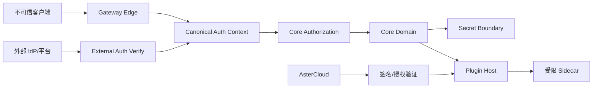

# 多租户、权限与安全

## 1. 安全目标

- 任何身份来源最终都归一为可审计、最小权限的 Auth Context。
- Profile、Tenant、Principal 和资源 Scope 在 API、Service、Repository 和缓存键中一致执行。
- Secret 永不以明文持久化、回显、记录日志或传给非必要组件。
- 插件和 AsterCloud 都不能扩大本地 Core 权限。
- 软件供应链从源码、构建、签名、发布、安装到撤销可验证。

## 2. 信任边界



每跨越一次边界都重新验证来源、受众、时间、Scope 和完整性，不能因为网络位于 localhost 或内网就默认可信。

## 3. 认证来源

| 来源 | 用途 | 安全要求 |
| --- | --- | --- |
| 管理 Session | 本地 UI 与管理 API | HttpOnly/Secure/SameSite、CSRF、Session Version、MFA |
| OIDC Identity | 企业人员登录 | Issuer/Audience/Nonce/PKCE、组映射白名单 |
| Gateway API Key | 数据面调用 | 高熵、只存 Hash、Fingerprint、Scope、轮换和过期 |
| External Signed Context | 外部平台委托 | HMAC/JWT、短时效、Nonce/JTI、防重放、Integration 绑定 |
| Plugin API Token | Sidecar 调 Host API | 每插件、最小 Scope、Surface、过期、可撤销 |
| Provider Callback | 外部任务通知 | Provider 专用签名、时间窗、Event ID、Body Digest |

禁止 Query String 传长期 Credential。兼容入口只在明确迁移窗口保留，并默认关闭或产生安全告警。

## 4. 授权模型

最终权限是交集，不是并集：

```text
Effective Permission = Profile Capability
                     ∩ Principal Role/Scope
                     ∩ Credential Scope
                     ∩ Resource Tenant
                     ∩ Governance Policy
                     ∩ Runtime Risk/Status
```

显式 Deny 优先于 Allow。资源 ID 查到但 Scope 不匹配时返回不泄露存在性的拒绝。系统管理员能力与业务管理员能力分离。

## 5. 多租户隔离

- 所有租户资源包含 `profile_scope` 和适用的 `tenant_id`。
- Repository 方法必须显式接收 Scope；禁止先按 ID 查再在调用者中补过滤。
- 唯一索引包含租户维度，避免跨租户命名或幂等冲突。
- Redis Key、对象存储 Key、Plugin Storage Namespace 和日志标签包含不可伪造的内部 Tenant ID。
- Usage Sink、Artifact Sink 与 External Auth Integration 绑定允许的 Profile/Tenant。
- 后台批处理逐租户领取和审计，不能用无界全表扫描绕过权限。

## 6. Secret 管理

| Secret | 存储 | 使用边界 | 展示 |
| --- | --- | --- | --- |
| AsterRouter `secret-key` | 环境/Secret Manager | 本地加密与签名根 | 从不展示 |
| Provider Secret | Core 加密列/外部 Vault | Provider 调用时短暂解密 | 仅 configured/hint |
| Gateway Key | 客户端持有，服务端只存 Hash | Credential 验证 | 创建时一次 |
| Plugin Config Secret | Core 加密存储 | 仅授权插件调用时注入 | 仅 hint |
| AsterCloud Signing Key | 文件/HSM/KMS 边界 | Catalog/License/Feed 签名 | 公钥可发布 |
| AsterCloud Pepper/JWT Secret | Secret Manager | 鉴权/兑换/激活 | 从不展示 |

Secret 轮换必须支持 key version、重加密或双验证窗口。更换 AsterRouter 根 Secret 前先完成可恢复迁移，不能直接导致所有密文不可读。

## 7. 插件安全模型

### 7.1 安装前

- 验证受信签名、Package Digest、Manifest Digest 和文件清单。
- 校验 Core/Profile/OS/Arch/协议版本和依赖。
- 展示 Capability 与 Permission 差异，新增网络或 Secret 权限需重新确认。
- 拒绝路径穿越、符号链接逃逸、超大解压和重复文件名。
- 执行恶意代码、Secret、依赖漏洞、许可证与 Schema 扫描。

### 7.2 运行时

- Sidecar 使用非特权用户、独立工作目录、资源上限和本机随机端口。
- 默认无 Core PostgreSQL/Redis 网络权限；出站只允许 Manifest 声明目标。
- Host API Token 绑定插件 ID、安装版本、Scope、Surface 和过期时间。
- Host 限制 Body、Header、超时、并发、重定向和响应 Schema。
- 前端贡献使用同源隔离、严格 CSP，不可读取 Provider Secret 或其他 Surface Session。

### 7.3 撤销

严重公告可阻止新安装、提示禁用或在策略允许时强制隔离已知恶意版本。离线实例导入撤销列表后执行相同判断；强制动作必须保留本地审批和审计证据。

## 8. AsterCloud 信任链

```text
Offline Root Key
  -> Online Catalog/License/Feed Signing Key (versioned)
      -> Signed Snapshot / Package / License / Advisory / Feed
          -> AsterRouter embedded/trusted public key
```

- Root 私钥不进入在线应用进程。
- 在线签名密钥有用途、有效期、状态和轮换记录。
- Snapshot 含单调序号、签发/过期时间和内容 Digest，防回滚。
- Key Compromise 有撤销、再签发、客户端信任更新和事件沟通 Runbook。

## 9. 数据最小化与隐私

AsterCloud 默认允许收集：Core 版本、插件 ID/版本、OS/Arch、License/Instance ID、匿名错误码和同步审计。默认禁止收集：Prompt、Response、Provider Secret、Gateway Key、企业用户列表、逐请求 Usage 和完整诊断。

任何可选遥测必须：

1. 管理员显式 Opt-in；
2. 展示字段、目的、保留期和接收方；
3. 本地可预览与关闭；
4. 不影响 License 基础验证和数据面运行；
5. 支持导出与删除请求。

## 10. Web 与 API 安全

- 管理 API 使用统一认证中间件、RBAC、CSRF 和 Origin 校验。
- 登录、Key、兑换、上传、回调和探测接口分别限流。
- 上传采用内容类型白名单、大小限制、随机对象键、服务端摘要和隔离扫描。
- URL 配置防 SSRF：拒绝本地元数据地址、危险协议、DNS Rebinding 和未授权重定向。
- 错误响应不泄露 SQL、文件路径、Secret、上游 Body 或签名内部状态。
- 安全 Header、CSP、Cookie 和 CORS 由统一层配置，不由插件放宽。

## 11. 审计

高风险事件至少记录：Actor、Auth Method、Profile/Tenant、Action、Resource、Before/After 摘要、Reason、Approval、Request ID、时间和结果。

必须审计：登录与 MFA、角色/Key 变更、Provider Secret、Route/价格发布、插件安装/权限变更、License、备份恢复、诊断导出、账务调整、安全撤销和审计导出。

审计不保存 Key/Secret/Prompt 原文。对不可变性要求高的环境可将摘要链或签名批次投递到外部 SIEM/WORM。

## 12. 威胁与控制

| 威胁 | 主要控制 |
| --- | --- |
| 跨租户 IDOR | Repository Scope、资源不可枚举 ID、负向授权测试 |
| Gateway Key 泄露 | Hash、一次展示、Scope/CIDR/限额、轮换、异常检测 |
| Provider Secret 泄露 | 加密、最小解密边界、日志脱敏、插件隔离 |
| 恶意插件包 | 签名、审核、SBOM、沙箱、权限确认、撤销 |
| Catalog 回滚/替换 | 单调序号、Digest、过期和 Key Version |
| Callback 重放 | 签名、时间窗、Nonce/Event ID 唯一约束 |
| SSRF | Endpoint Policy、DNS/IP 检查、出站代理 |
| 账务篡改 | 事务、只追加 Ledger、职责分离、对账 |
| 队列重复执行 | Lease、Dispatch Key、CAS、Provider Reconcile |

## 13. 安全发布门槛

- 租户隔离、权限矩阵、IDOR 和越权回归通过。
- Secret 扫描、依赖漏洞和镜像/二进制 SBOM 达标。
- 插件包路径、签名、权限升级和 Sidecar 逃逸测试通过。
- Auth/Callback/Upload/External URL 模糊测试与限制测试通过。
- 日志、Trace、诊断、备份和错误响应的敏感信息检查通过。
- 恢复、根密钥和签名密钥轮换完成演练并留证。
