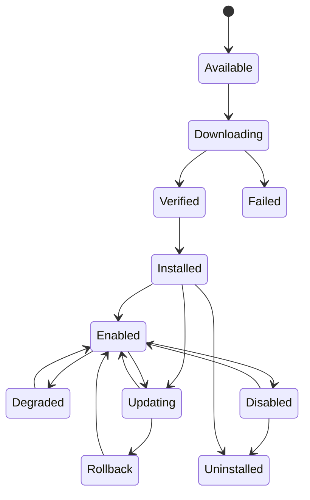
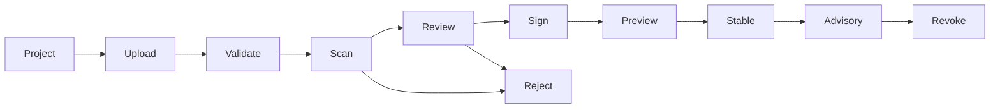

# 插件体系与开放平台设计

## 1. 目标与边界

插件体系允许 AsterRouter 在不修改 Core 的前提下扩展场景 UI、Provider 协议、官方数据服务、通知、报表和 Artifact Sink，同时保持身份、路由、计量、账务和审计不变量。

插件不是任意代码注入机制。每个插件都经过声明、审核、授权、安装、隔离、观测和撤销。

## 2. 当前官方插件

| 插件 | Runtime | Surface | Tier | 核心边界 |
| --- | --- | --- | --- | --- |
| ImageGen Workbench `0.3.8` | Frontend | Personal/Enterprise | Free Core | 浏览器调用 Core 图片 API，不持有 Provider Secret |
| VideoGen Workbench `0.2.4` | Sidecar + Frontend | Personal/Enterprise | Free Core | Adapter 映射图片/视频任务，Core 管 Job/Usage/Artifact |
| MonitorPrice `0.1.16` | Sidecar + Frontend | Enterprise/Relay | Free Core | 采购比价和容量情报，不直接裁决账务 |
| Provider Trust `0.1.2` | Sidecar + Frontend | manifest 定义 | Paid Add-on | 本地探测和报告，不上传 Secret/结果到 AsterCloud |

四个插件必须使用同一 Host 与协议，不在 Core 中增加按插件 ID 判断的业务分支。

## 3. 插件分类

| 类型 | 扩展点 | 是否允许热路径 | 典型权限 |
| --- | --- | --- | --- |
| Frontend Workbench | Navigation/Page/Widget | 否 | 同源 Core API Scope |
| Provider Adapter | Dispatch/Reconcile/Cancel/Output | 受控调用 | 声明 Provider Endpoint 出站 |
| Data Service | Feed Import/Query/Report | 否 | 插件存储、签名 Feed |
| Notification | Alert/Event Delivery | 异步 | 声明目标出站 |
| Artifact Sink | Store/Deliver/Delete | 异步 | 目标存储 Secret 与出站 |
| Report/Export | 授权聚合查询 | 否 | Read Scope、资源配额 |
| Entitlement Adapter | 外部权益检查 | Admission 有界调用 | 签名请求、严格超时与缓存 |

通用 Request/Response Filter、任意 SQL、任意网络代理和远程控制插件不在 v1 范围。

## 4. Manifest v1

当前 Schema 名为 `astercloud.plugin-manifest.v1`，核心字段：

```json
{
  "schema_version": "astercloud.plugin-manifest.v1",
  "id": "com.vendor.product.feature",
  "name": "Display Name",
  "version": "1.2.3",
  "vendor": "Vendor",
  "category": "content",
  "type": "video_generation",
  "runtime": "sidecar",
  "surfaces": ["enterprise"],
  "tier": "free_core",
  "min_core_version": "0.18.0",
  "capabilities": [],
  "permissions": [],
  "frontend": {"contribution": "frontend/contribution.json"},
  "entrypoint": {"linux-amd64": "backend/linux-amd64/plugin"},
  "provider_adapters": [],
  "schemas": []
}
```

### 4.1 标识与版本

- Plugin ID 采用反向域名且发布后不可变。
- Version 使用 SemVer；相同 `id + version` 的内容 Digest 永不变化。
- `min_core_version` 与未来可选 `max_core_version` 只是初筛，最终以 Compatibility Record 为准。
- Runtime、Tier、Capability 和 Permission 值来自 Core Registry，不接受未声明自由字符串静默生效。

### 4.2 Capability 与 Permission

Capability 表示插件提供什么，Permission 表示插件需要访问什么。二者分离：

```text
Declared Capability
  + Installed Package
  + Compatible Core/Profile/Platform
  + Valid Entitlement
  + Granted Permission
  + Valid Configuration
  + Healthy Runtime
  = Effective Contribution
```

新增 Permission 或扩大范围属于安全敏感升级，不能沿用上一版本的无感批准。

## 5. Package 格式

当前官方仓库产出 `.pkg` 文件。包至少包含：

```text
plugin.json
checksums.txt / package digest metadata
frontend/
  contribution.json
  dist/...
backend/
  {os}-{arch}/entrypoint
schemas/
rules/ or static data (optional)
```

签名可以作为包 Envelope 或 Catalog Package Record 提供，但最终必须绑定完整 Package Digest。安装器拒绝：绝对路径、`..`、设备文件、逃逸符号链接、超限文件/总大小、重复规范化路径和 Manifest 不一致。

## 6. 生命周期



安装与启用分离；禁用不删除 Config/历史；卸载默认保留数据。Purge 是单独高风险操作。

### 6.1 安装原子性

1. 下载或上传到 Staging。
2. 验证签名、Digest、兼容性、授权和权限。
3. 解压到版本化 Staging 目录并校验文件清单。
4. 写 Installation 计划和审计。
5. 原子切换 `active/{plugin_id}` 指针或目录。
6. 启动 Runtime、执行 Health，成功后标记 Enabled。
7. 任一步失败可依据 Installation + Staging/Active Reconcile。

## 7. Sidecar Runtime

### 7.1 Supervisor

当前通用 Supervisor 目标状态：`starting`、`running`、`backing_off`、`stopped`、`disabled`、`uninstalled`、`failed`。

- 仅 Enabled + Installed + 匹配 Manifest/Version 的 Sidecar 可启动。
- Host 分配 `127.0.0.1:0` 随机端口和每次启动的新 Token。
- 非主动退出按 1、2、4 秒指数退避，上限 30 秒并增加抖动。
- 更新前停止旧进程，切换 Active 后创建新 Supervisor。
- Shutdown、Disable、Uninstall 必须回收进程和临时 Token。

### 7.2 资源与系统隔离

目标生产配置：非特权 UID、独立工作目录、只读 Package、可写 Plugin Data、CPU/内存/进程/文件限制、无 Core DB/Redis 网络、出站代理 Allowlist。不同操作系统采用可用的沙箱机制，但安全语义一致。

### 7.3 Host 调用 Envelope

统一请求至少包含协议版本、request ID、plugin ID/version、operation、deadline 和已授权 Context。统一响应包含 request ID、status、error code、retryability 和 payload。

Host 强制：

- 请求/响应大小、并发和 Deadline；
- Header 白名单与 Hop-by-hop 清理；
- Token Audience、Plugin/Version/Scope 匹配；
- JSON Schema 或扩展点契约验证；
- 日志脱敏和 Trace 关联。

## 8. Provider Adapter 契约

标准扩展点：

| 方法 | 输入 | 输出 |
| --- | --- | --- |
| `dispatch` | 标准请求、Attempt、短期 Provider Credential | Provider Task/Direct Result/Unknown |
| `reconcile` | Provider Task Reference | 标准状态、进度、Usage、输出引用 |
| `cancel` | Task Reference、幂等 Action ID | 已取消/不可取消/未知 |
| `output` | Task Reference/Output Ref | 有界 Stream 或 Artifact Source |

Adapter 不选择租户、Key、价格或 Route，不写 Job/Attempt，不把 Provider Secret 写入 Dispatch Intent。Core 对 Adapter 返回的 URL、Usage、状态和媒体大小再次验证。

## 9. 前端贡献

`contribution.json` 声明导航位置、Route、入口资产、Surface、权限和本地化。Host 只服务已安装且启用版本的静态资产。

- 贡献页面使用 AsterRouter Design Token 与公共组件契约。
- 浏览器只通过同源 Core/Plugin Host API，不直接读取 Sidecar 随机端口。
- Workspace Key 若由工作台创建，只在当前浏览器 Session 保存；更推荐 Host Session 委托短期 Credential。
- CSP 不允许插件自行放宽；外部媒体域通过声明和管理员批准。
- 禁用/卸载后 Route 失效，深链返回明确不可用状态。

## 10. 配置与数据

- Config Schema 决定字段类型、默认值、敏感性和验证规则。
- Secret 单独提交、加密存储、只显示 Hint；Sidecar 只在授权调用时收到必要值。
- Sidecar Version 更新不改变版本独立 Data Dir。
- 插件私有 Schema Migration 先备份、可重试并记录版本；失败不启动新版。
- Plugin Storage 有配额、备份、导出和保留策略。

## 11. AsterCloud 开发者平台



自动检查至少覆盖 Manifest、Schema、Package、安全、Secret、依赖、License、权限和兼容性。人工审核关注数据流、权限必要性、降级、隐私和用户体验。签名是独立受保护操作，不等同审核员点击批准。

## 12. 兼容性

矩阵维度：Core SemVer、Plugin API/Host Protocol、Profile、Surface、OS、Arch、Package Format、Config Schema、Data Schema、Provider Adapter Contract。

Core 发布前对 Stable 插件运行：安装、启用、主要动作、禁用、升级、回滚和卸载契约测试。破坏性 Host 变更发布新协议版本并提供至少一个迁移窗口。

## 13. 安全公告与撤销

Advisory 包含严重度、CVE/内部编号、影响版本表达式、修复版本、缓解措施、是否阻止安装和建议动作。AsterRouter 本地匹配已安装 Package Digest，而不是只比对显示版本。

紧急恶意版本可标记 `blocked`：

- 新安装拒绝；
- 已安装显示强告警并隔离自动调用；
- 是否强制禁用遵循本地安全策略和离线撤销规则；
- 所有动作保留本地审计，AsterCloud 不远程执行命令。

## 14. 插件 GA 验收

- 四个官方插件通过相同 Manifest、Package、Host 与 Conformance Suite。
- 篡改、路径穿越、权限升级、Token 伪造和 Sidecar 越权测试通过。
- Sidecar 进程/网络/资源故障不破坏 Core 或其他插件。
- 断网环境可安装离线包、验证 License 并运行已授权能力。
- Core 升级兼容矩阵、插件回滚和安全撤销完成端到端演练。
- 插件停机不会产生重复 Provider Task、丢 Usage、越权 Artifact 或账务不一致。
