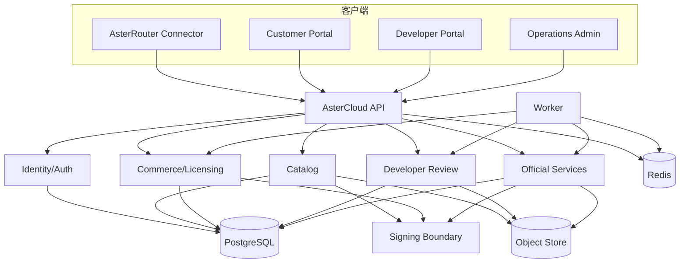
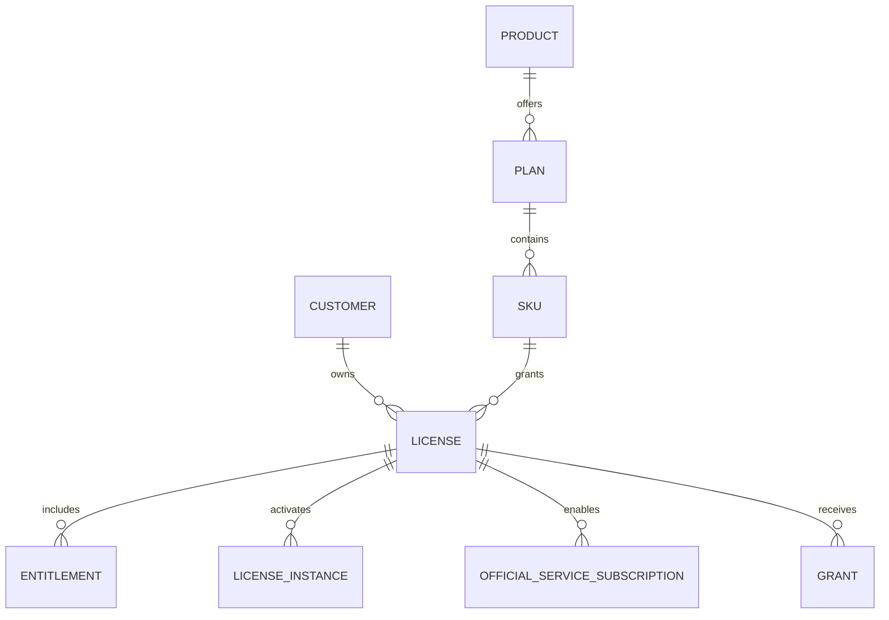
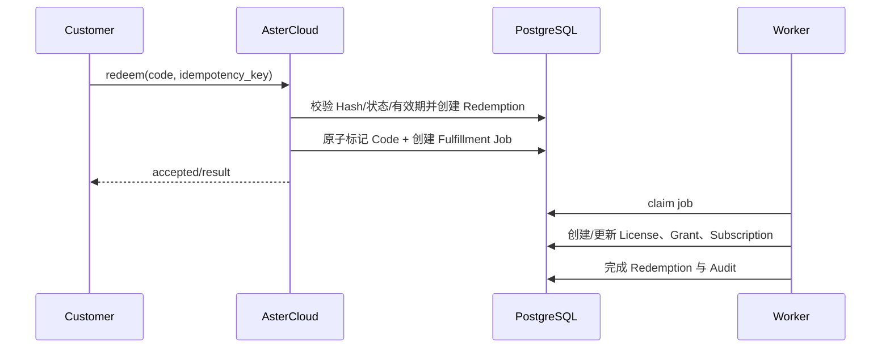

# AsterCloud 官方服务中心设计

## 1. 产品定位

AsterCloud 是 AsterRouter 的官方服务中心，负责可信软件供应链、商业授权、开发者生态和官方数据服务。它增强私有实例，但不代理客户 AI 请求、不默认收集私有调用数据，也不远程控制实例运行时。

## 2. 服务边界

### 2.1 负责

- Core Release、Plugin Catalog、Package 和 Compatibility。
- Signing Key、Catalog/Package/License/Feed 签名和安全公告。
- Customer、Product、Plan、SKU、License、Entitlement、Grant 和 Subscription。
- Redeem Code、在线激活、离线 License 和履约 Worker。
- Developer Account、Project、Upload、Scan、Review 和发布。
- Official Service、Provider Intelligence、Probe 和加密 Feed。

### 2.2 不负责

- Gateway 请求转发、Route 决策、Provider Secret 和任务运行。
- 私有实例的用户、部门、Prompt、Response、Artifact 和逐请求 Usage。
- 远程安装、启停插件或修改本地 Provider 配置。
- 客户业务系统的终端登录、订单支付和产品 Session。

## 3. 逻辑架构



API 无状态水平扩展；Worker 通过数据库/队列 Lease 执行履约、扫描和 Feed 任务。签名私钥位于独立安全边界，应用数据库只保存公钥、Key 元数据和签名操作记录。

## 4. 身份与角色

| Principal | 入口 | 权限范围 |
| --- | --- | --- |
| System Admin | Admin | 全局配置和应急，强 MFA |
| Catalog Operator | Admin | 插件/Core/公告草稿，不直接持有签名 Key |
| Commerce Operator | Admin | 客户、产品、License 和 Grant |
| Reviewer | Admin | 查看扫描证据、批准/拒绝 Review |
| Developer | Developer Portal/API | 自身组织、项目、上传和审核 |
| Customer Admin | Customer Portal/API | 自身 License、实例、订阅和离线文件 |
| AsterRouter Instance | Official API | 绑定实例的 Catalog/Package/License/Feed |
| Probe Node | Probe API | 领取授权任务、提交签名结果 |

显式 Permission Grant/Deny 优先于粗粒度 Role。高风险操作重新认证并需要职责分离。

## 5. Catalog 与 Package

### 5.1 发布模型

```text
Plugin -> Version -> Manifest -> Compatibility -> Package(os, arch, digest)
                                        -> Release Channel
Catalog Snapshot -> immutable version set + advisory + core release metadata
```

Version 和 Package 发布后不可变。修复必须发布新 SemVer。Snapshot 使用单调序号、签发/过期时间、Key ID、Payload Digest 和签名。

### 5.2 Bootstrap

Bootstrap 是小型、长期稳定、可缓存文档，包含 Catalog URL、Services URL、License URL、当前 Signing Key 和轮换链。AsterRouter 先用内置 Root Trust 验证 Bootstrap，再验证 Snapshot。

### 5.3 下载授权

付费或受限 Package 下载使用短时 Download Grant，绑定 Customer、License/Entitlement、Package Digest、Instance 和过期时间。URL 泄露不能绕过最终 Package 签名与本地 Entitlement 检查。

## 6. License 与 Entitlement



签名授权至少包含 License ID、Customer、Instance Binding、Core/Profile 范围、Plugin/Capability Entitlement、配额、签发/过期、Grace、序号和撤销检查信息。

### 6.1 在线激活

实例生成稳定 ID、Fingerprint 和可选加密公钥，使用一次 Nonce 请求激活。AsterCloud 校验 License、激活席位和风险，生成签名 Snapshot。重试同一 Idempotency Key 返回同一结果。

### 6.2 离线激活

离线请求文件包含 Instance、Nonce、能力和公钥，不含 Provider Secret。响应文件绑定请求 Digest 和 Instance，由 AsterCloud 签名、可选对实例公钥加密。本地重复导入幂等。

### 6.3 Grace 与撤销

- Grace 是签名授权的显式字段，不由客户端自行延长。
- 普通过期可进入有限只读/续期提示；安全撤销可跳过 Grace。
- 本地无法在线检查撤销时使用最近有效撤销列表和风险策略。
- AsterCloud 不通过“停服开关”直接关闭客户 Gateway Core 基础能力。

## 7. 兑换与履约



任何重试都不能重复消费 Code 或产生重复 Grant。失败状态区分可重试、需要人工和永久拒绝。

## 8. Developer Platform

### 8.1 上传

- Upload Session 绑定 Project、Version、预期大小和 SHA-256。
- 使用预签名分片上传或受限 API，完成时服务端重新校验摘要。
- 上传对象在隔离前缀，未审核资产不可被 Catalog 下载。

### 8.2 审核

Review Step 至少包括：Manifest、Package、安全、依赖、许可证、权限、隐私、兼容、功能证据和人工决策。Scan Result 保留工具、规则版本、严重度、文件定位和处置状态。

### 8.3 发布

批准产生“可签名发布意图”，Signer 独立确认输入 Digest 后签名。Preview -> Stable 需要观察窗口、安装验证和无阻断安全问题。撤回版本不删除历史 Package 与审计。

## 9. Official Service 与 Feed

| 对象 | 含义 |
| --- | --- |
| Service | Provider Intelligence 等独立商业数据服务 |
| Service Version | API/Data Schema 与发布 Channel |
| Schema Compatibility | 某 Core/Plugin 能否消费此版本 |
| Feed | 某客户/实例在时间窗内的签名数据快照 |
| Probe Node/Task | 经授权的探测执行者与任务 |

Feed Envelope 包含 Service、Version、Schema、Customer/Instance Audience、Issued/Expires、Sequence、Payload Digest、Encryption 和 Signature。客户端先验签、解密、Schema 校验，再原子替换本地投影。

## 10. Provider Intelligence

Provider Intelligence 可保存公开/授权探测的 Provider、Endpoint、可用率、延迟、错误、价格和模型证据。探测要求：

- 客户提供的 Provider Secret 只在其 AsterRouter 本地执行，不上传 AsterCloud。
- AsterCloud Probe Node 只使用 AsterCloud 自有或明确授权凭据。
- 结果带采样位置、时间、模型、规则版本和置信度。
- 公开 Feed 使用聚合与最小化，不能反推出客户流量。
- 数据陈旧时显式降级，不能继续作为高置信 Route 输入。

## 11. 签名与密钥

### 11.1 Key 用途分离

- Offline Root：签发/轮换在线公钥，不在线。
- Catalog/Package Signing：软件供应链。
- License Signing：商业授权。
- Feed Signing/Encryption：官方数据服务。

不同用途不复用私钥。Signing Operation 保存输入 Digest、用途、Key Version、Actor/Service、结果和时间，不保存私钥。

### 11.2 轮换

1. Root 签发新在线 Key 元数据。
2. Bootstrap 同时发布旧/新信任链。
3. 客户端更新并 ACK 新 Key。
4. 新资产使用新 Key，旧资产在有效期内仍可验。
5. 达到覆盖门槛后停用旧 Key。

泄露时发布紧急 Root-signed Revocation，重新签发受影响资产并跟踪客户端覆盖。

## 12. 隐私与遥测

默认允许字段：Instance/License ID、Core/Plugin Version、OS/Arch、同步状态、匿名错误码。默认禁止 Prompt、Response、Artifact、Provider Secret、Gateway Key、企业用户和逐请求 Usage。

可选遥测采用独立 Consent Record、版本化 Schema、目的和保留期；License 基础使用权不以交出私有调用数据为条件。

## 13. 可用性与灾备

- API 多副本、Worker 多副本、PostgreSQL HA、Redis HA、Object Store 版本化。
- Catalog/Package 使用 CDN/缓存；客户端 Last-known-good 降低瞬时故障影响。
- Signing Key 备份与恢复独立演练，不能仅依赖数据库备份。
- 商业与签名事实目标 RPO=0 或接近 0；异地恢复目标见 [多实例部署与容灾设计](./19-多实例部署与容灾设计.md)。

## 14. 验收

- Catalog、Package、License、Feed 的篡改、回滚、过期、未知 Key 全部拒绝。
- 在线/离线激活、兑换和履约重试无重复权利。
- 开发者无法读取其他组织 Project/Upload/Review。
- Reviewer 不能绕过受保护 Signer 替换 Package。
- AsterCloud 全面不可用时，本地实例按有效 Snapshot/Grace 正常降级。
- 数据盘点证明不存在默认上传私有调用内容的链路。
