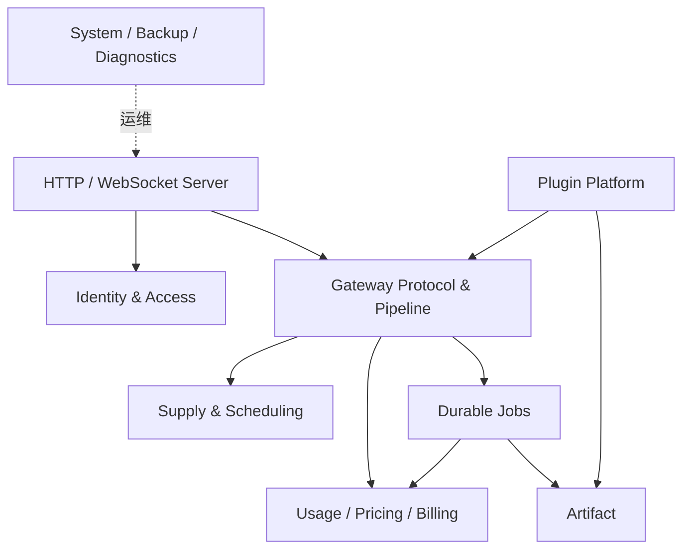

# 系统拆分与 MVP 迭代

## 1. 最终建议

产品体系保持多个独立仓库，但不拆成大量必须同时在线的微服务：

```text
asterrouter              本地 Core、UI、部署与 Plugin Host
astercloud               官方服务中心 API、Worker、UI 与迁移
imagegen                 官方前端场景插件
videogen                 官方前端 + Provider Adapter Sidecar
monitorprice             官方 FinOps 数据插件
provider-trust-plugin    官方 Provider Trust Sidecar
plugin-sdk (TARGET)      Manifest/Host types、工具与 Conformance Kit
```

AsterRouter 内部按限界上下文模块化，先保持可部署单体；只有扩缩、故障隔离或安全边界有真实需要时，才按进程 Role 分离。AsterCloud API 与 Worker 分离，但共享同一领域与数据库。

## 2. 为什么不合并 AsterRouter 与 AsterCloud

| 维度 | AsterRouter | AsterCloud |
| --- | --- | --- |
| 部署 owner | 客户/私有环境 | AsterCloud 运营方 |
| 敏感数据 | Provider Secret、请求、Usage、Artifact | 目录、授权、开发者、官方服务 |
| 可用性 | 必须本地自治 | 可通过 Snapshot/Grace 降级 |
| 发布节奏 | 客户控制、兼容优先 | SaaS 持续发布 |
| 数据库 | 客户本地 PostgreSQL | 官方 PostgreSQL |
| 安全根 | 本地 Secret 与策略 | 签名根、商业授权 |

合并会让私有数据、故障域和升级节奏耦合，也会破坏离线部署目标。

## 3. AsterRouter 模块边界



### 3.1 依赖规则

- `server` 只做协议、认证中间件、DTO 和错误映射，不承载业务事务。
- `gatewaycore` 维护协议规范化类型，不依赖 Profile UI 或具体 Provider。
- `controlplane` 逐步拆为 IAM、Supply、Execution、FinOps、Artifact 领域 Service/Repository。
- `provideradapter` 实现协议映射接口，不调用管理面 Service 修改路由。
- `plugins` 只通过公开领域端口接入，不读取 Repository 具体实现。
- 配置、加密、HTTP 工具保持小而稳定，不反向依赖领域。

## 4. AsterCloud 模块边界

当前 `internal/domain`、`internal/app`、`internal/infra` 分层方向保留：

| 模块 | 责任 |
| --- | --- |
| Identity/Auth | Principal、Credential、Session、Permission |
| Commerce/Licensing | Customer、Product、SKU、License、Entitlement、Grant |
| Redeem/Fulfillment | Code、Redemption、Job 和幂等履约 |
| Catalog | Plugin/Core Release、Package、Snapshot、Advisory |
| Developer | Account、Project、Upload、Review、Scan |
| Official Service | Service Version、Feed、Compatibility |
| Provider Intelligence | Provider、Endpoint、Probe |
| Signing | 用途分离的签名端口与受保护实现 |
| HTTP API | Auth、DTO、Pagination、Error Envelope |
| Worker | 可重试异步 Handler 与 Lease |

应用服务通过小接口依赖 Store、Object Store、Scheduler 和 Signer，基础设施实现不进入 Domain。

## 5. 插件仓库边界

每个插件仓库独立拥有：Manifest、Frontend、Sidecar（如需）、Schemas、静态数据、构建脚本和契约测试。不得复制：Core Auth/Key、Provider Route、Usage Ledger、Artifact ACL 或 AsterCloud 发布逻辑。

共同部分进入 `plugin-sdk` 或版本化构建工具：

- Manifest 类型与 Schema。
- Host Envelope 与错误码。
- Frontend Contribution 类型和本地测试 Host。
- Package Builder、Checksum、SBOM 和签名请求格式。
- Provider Adapter Conformance Fixtures。

SDK 只在出现三处以上稳定重复并完成协议冻结后提取，避免过早抽象。

## 6. 进程拆分

### 6.1 MVP

| 系统 | 进程 | 原因 |
| --- | --- | --- |
| AsterRouter | `all-in-one` + Sidecar 子进程 | 最低部署复杂度，保持边界接口 |
| AsterCloud | `server`、`worker`、`migrate` | SaaS API 与异步履约负载不同 |

### 6.2 Scale

AsterRouter 再支持 `api`、`worker`、`plugin-host`、`migrate` Role。拆分条件：

- Worker 与 API 的资源曲线显著不同；
- Sidecar 需要更强 OS/网络隔离；
- 多副本协调已从进程内迁至 PostgreSQL/Redis；
- 独立 Role 有健康、SLO、部署与故障恢复测试。

不因代码目录存在就创建独立服务。

## 7. API 边界

| API | 调用方 | 稳定性 |
| --- | --- | --- |
| Gateway `/v1/*` | 客户应用 | 公开、版本化、最高兼容要求 |
| Management `/api/v1/*` | 内置 UI/管理员 | 版本化，随 Core 发布 |
| Plugin Host `/api/v1/plugin-host/*` | Sidecar/Plugin Frontend | 协议版本 + Conformance |
| AsterCloud Official `/official/v1/*` | AsterRouter Connector | 签名、长期兼容、可缓存 |
| AsterCloud Developer/Admin | Portal/Automation | 租户 API，版本化 |
| Provider Callback | Provider | Adapter/Provider 专用、强验签 |

跨边界传 DTO/Event，不共享 Go 内部 Model 包作为远程协议的唯一定义。

## 8. MVP 迭代

### MVP-A：边界与正确性

- 完成 M0/M1：协议、状态机、幂等、Usage/Artifact 和故障测试。
- 交付 all-in-one 私有部署与四个 Profile 的主路径。
- 插件继续支持当前官方插件，但冻结 Host v1。

### MVP-B：插件可信交付

- 完成 Package/Manifest/Permission、安装回滚和 Sidecar 隔离。
- AsterCloud Catalog/Developer Review/签名闭环。
- 四个官方插件完成 Conformance 和独立发布。

### MVP-C：官方授权与离线

- Product/SKU/License/Entitlement、在线/离线激活、兑换履约。
- Catalog/Package/Feed 离线 Bundle 与防回滚。
- AsterCloud/API Worker 的备份、恢复和签名轮换。

### MVP-D：规模化与 FinOps

- AsterRouter API/Worker 分角色，多副本 Redis 协调。
- SLO/OTel/故障演练、Effective Price、成本路由与对账。
- 再评估 Plugin Host 独立部署和多 Region。

## 9. 兼容路径治理

| 路径 | 分类 | 策略 |
| --- | --- | --- |
| Legacy Admin Token | `COMPAT/DEPRECATED` 候选 | 默认关闭，迁移到 Session/API Credential |
| Relay Customer/Balance | `CURRENT` Profile 专属 | 不扩展为通用 Platform Commerce |
| Workspace User 上的余额/限额 | `COMPAT` | 新通用能力转向 Principal/Policy/Ledger |
| Query Credential | `DEPRECATED` | 统计调用、警告、关闭默认支持 |
| 业务侧重复 AI Proxy | `DEPRECATED` | 迁移到 Gateway API 后删除 |
| 插件专用 Core 分支 | `DEAD` | 用统一扩展点替代并加守卫测试 |

## 10. 开发工作流

跨仓库变更顺序：

1. 先发布兼容的新协议/Schema 与 Contract Fixture。
2. 更新 AsterRouter Host 或 AsterCloud API，保持旧消费者可用。
3. 更新插件/Connector 并完成矩阵测试。
4. 观察稳定后停止旧协议新增调用方。
5. 到约定版本移除兼容路径。

禁止在多个仓库复制尚未冻结的结构定义后同时改字段。

## 11. 测试所有权

| 测试 | Owner |
| --- | --- |
| Core Domain/Repository/Gateway Contract | AsterRouter |
| Host Protocol/Package/Sidecar Conformance | AsterRouter + SDK |
| 插件业务与 Adapter Fixture | 对应插件仓库 |
| Catalog/License/Review/Fulfillment | AsterCloud |
| Core-Cloud-Plugin 端到端矩阵 | 联合 Release Pipeline |
| 私有部署、HA、升级、恢复 | AsterRouter Release |

## 12. 完成定义

- 一个领域事实只有一个 Owner 和一条权威写路径。
- 仓库间通过版本化协议/资产交互，不通过共享数据库或相对源码路径运行。
- 单机组合与进程拆分使用同一 Domain/Repository/Contract。
- 插件移除不需要修改 Core Schema 或恢复 Core 数据。
- AsterCloud 停机不阻塞有效授权内的 AsterRouter 数据面。
- 每个兼容层有删除条件，不形成永久双轨。
