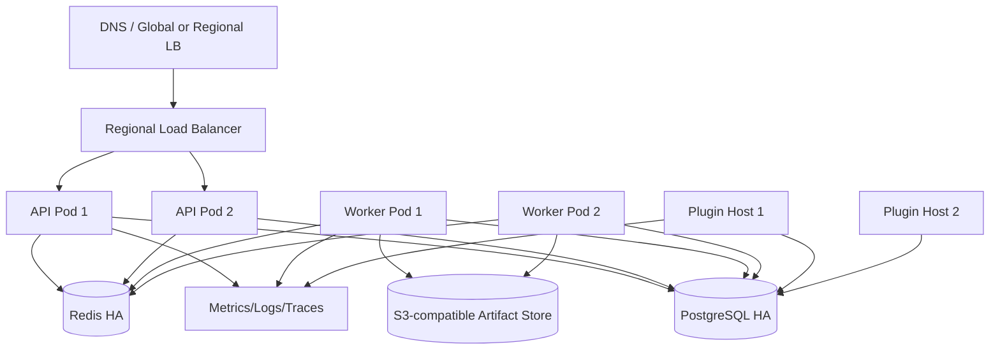
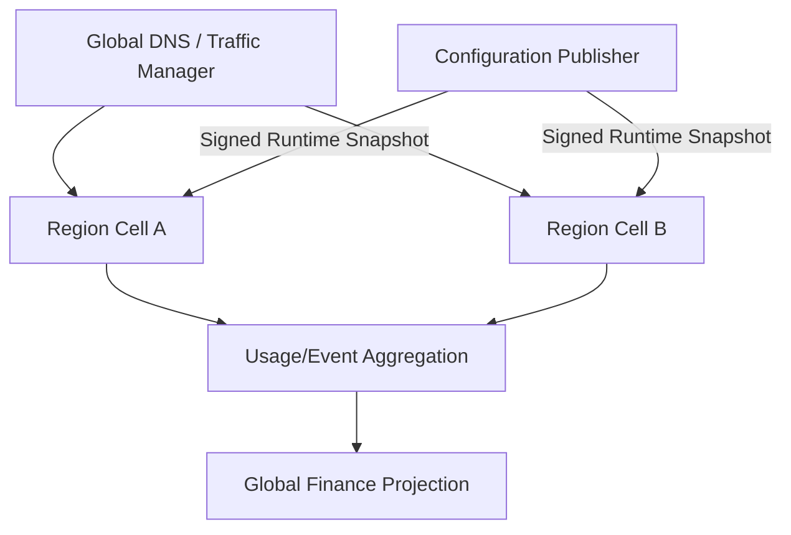

# 多实例部署与容灾设计

## 1. 决策摘要

1. 先完成单 Region HA，再评估多 Region；多 Region 不是修复单点和幂等问题的手段。
2. AsterRouter 使用标准 Cell：API、Worker、Plugin Host、PostgreSQL、Redis、Artifact Store 和观测。
3. PostgreSQL 保存权威事实，Redis 可丢弃重建，Object Store 保存大对象内容。
4. AsterCloud 独立部署和容灾，不与客户 AsterRouter 共享网络或数据库。
5. 全球流量、数据驻留和跨区任务只有在 Tenant Policy 明确允许时生效。

## 2. 部署等级

| 等级 | 拓扑 | 适用 | 承诺 |
| --- | --- | --- | --- |
| D0 Development | 单进程 + Memory/临时 PG | 源码开发 | 无生产持久性 |
| D1 Standalone | all-in-one + PostgreSQL + 本地/S3 | 个人、小团队、轻负载 | 可备份恢复，维护窗口升级 |
| D2 HA Cell | 多 API/Worker + PG HA + Redis HA + S3 | 企业生产 | 单节点容错、滚动升级 |
| D3 Multi-Region | 多个独立 HA Cell + 全球入口 | 有明确地域/SLO需求 | 受策略约束的跨区容灾 |

安装文档必须明确当前部署等级，不能把 D1 描述为自动高可用。

## 3. 单 Region HA Cell



### 3.1 API

- 至少两个副本跨故障域，Readiness 在流量切入前通过。
- 管理 Session 可使用签名 Cookie/共享存储，Session Version 在 PostgreSQL。
- Rate/Capacity/Affinity 的多副本原子状态放 Redis 或 PostgreSQL，不只在内存。
- WebSocket/Realtime 连接由 LB 保持，节点终止先停止新连接并完成 Drain。

### 3.2 Worker

- Worker 使用数据库/Redis Lease 领取 Job、Outbox、Retention 和 Delivery。
- 终止时停止领取，续租或释放当前任务；超时由其他 Worker Reconcile。
- 扩容以可派发 Work Unit 和 Provider Capacity 为上限。

### 3.3 Plugin Host

Provider Adapter 是否可多副本并发由 Core 的 Attempt/Dispatch Lease 保证，不依赖 Sidecar 自身互斥。需要单例的数据同步插件通过分布式 Leader Lease。Sidecar Package 和 Config 在各节点一致，私有数据需共享存储或明确节点归属。

## 4. 数据一致性

### 4.1 PostgreSQL

- 使用单写主库与同步/准同步 HA；应用只通过稳定 Endpoint 连接。
- 关键事务重试只针对可识别的序列化/连接切换错误，并重新读取状态。
- 连接池总量按所有副本预算，不因扩容耗尽数据库连接。
- Migration 是独立单例 Job，完成后应用才进入 Ready。

### 4.2 Redis

- Redis 保存可重建协调状态，不保存唯一 Usage、Ledger、Job 或 License。
- Lua/事务实现 Capacity Permit、Lease、Ready Index 和 Affinity 的原子操作。
- Namespace 包含 Environment/Instance/Profile，避免共享集群 Key 冲突。
- Redis Flush/Failover 后运行 Rebuild/Reconcile，再恢复 Durable 派发。

### 4.3 Artifact Store

- 生产 HA 使用 S3-compatible 多副本服务，启用服务端加密、Versioning（按需要）和 Lifecycle。
- 数据库 `ready` 前验证对象大小/摘要；删除失败保留状态并重试。
- 跨 Region 复制不自动赋予跨区访问权限。

## 5. 滚动发布

```text
Preflight -> Backup/Restore Point -> Migrate Expand
-> Deploy compatible API/Worker -> Observe
-> Switch behavior/Backfill -> Contract in later release
```

- 新旧版本混跑期间 Event、DB Enum、Host Protocol 和 Job Payload 向后兼容。
- API 先停止 Ready，再 Drain HTTP/Realtime；Worker 先停止领取再退出。
- Sidecar 更新按插件逐个灰度，旧 Package 保留回滚。
- 回滚应用版本不能依赖已 Contract 删除的 Schema。

## 6. 故障模型与响应

| 故障 | 自动行为 | 人工动作 |
| --- | --- | --- |
| API 节点退出 | LB 摘除，连接重试 | 查崩溃与容量，决定回滚 |
| Worker 退出 | Lease 到期，其他 Worker Reconcile | 检查 Unknown Dispatch 与积压 |
| PostgreSQL 主切换 | 新连接到新主，事务重新判定 | 验证 RPO、Job/Outbox/Ledger |
| Redis 故障 | 暂停依赖原子协调的新派发或降级 | 修复后 Rebuild Index/Capacity |
| Object Store 故障 | Artifact 保持 pending/failed，不伪 Ready | 恢复并重试摄取/交付 |
| Sidecar 重启风暴 | Supervisor 退避、熔断插件 Route | 回滚/禁用插件 |
| AsterCloud 不可达 | 使用 Last-known-good Snapshot | 检查过期窗口与安全公告 |
| Provider 大面积故障 | 熔断、受控 Route 切换、背压 | 验证替代供应质量/成本 |

## 7. 备份

### 7.1 AsterRouter

| 数据 | 方式 | 频率候选 | 加密 |
| --- | --- | --- | --- |
| PostgreSQL | 全量 + WAL/PITR | 每日全量、连续 WAL | 必须 |
| 配置/Secret 引用 | 受控配置备份 | 变更后 | 必须 |
| Plugin Package/Data | Package 清单 + 数据目录快照 | 每日/更新前 | 必须 |
| Local Artifact | 文件快照或迁移 S3 | 按 RPO | 必须 |
| S3 Artifact | Version/Lifecycle/复制 | 按策略 | 服务端加密 |

### 7.2 AsterCloud

除 PostgreSQL、Redis 重建数据和 Object Store 外，单独备份 Signing Key/Root 材料、恢复程序和双人控制文档。密钥备份与数据库备份分开保管。

## 8. 恢复顺序

1. 建立隔离恢复环境和网络边界。
2. 恢复 Secret/Key 材料与 PostgreSQL 到目标时间点。
3. 恢复/连接 Object Store 和 Plugin 资产。
4. 以 `migrate` 验证 Schema，不立即开放流量。
5. 启动只读管理/诊断，运行一致性检查。
6. Reconcile Job、Attempt、Outbox、Artifact、Installation 和 License Snapshot。
7. 执行抽样 Gateway、Plugin、Usage 和账务测试。
8. 经审批切流，持续观察错误预算。

未知状态 Attempt 先查询 Provider；不得因恢复而重新创建所有 running Job。

## 9. RPO/RTO 目标候选

需要通过演练转为正式目标：

| 数据/服务 | RPO 候选 | RTO 候选 |
| --- | --- | --- |
| Usage/Ledger/License/Grant | 0（事务 + 同步 HA/PITR） | 30 分钟 |
| Job/Attempt/Outbox | 0 | 30 分钟并完成 Reconcile |
| 管理配置/插件安装 | 5 分钟内 | 60 分钟 |
| Artifact Metadata | 0-5 分钟 | 60 分钟 |
| Artifact Content | 按客户 Policy | 按 Store 等级 |
| AsterCloud Catalog/Package | 对象版本零丢失目标 | 60 分钟，CDN/本地缓存可降级 |

RPO=0 是架构目标而非口号，只有同步复制、事务日志和恢复演练证据同时满足时成立。

## 10. 多 Region 目标架构



每个 Region Cell 可在控制面短时不可用时使用最后有效 Runtime Snapshot。Cell 之间不进行任意双向业务表同步。

## 11. Region 选择与数据驻留

- Tenant 声明 `allowed_regions`、`home_region` 和 `cross_region_failover`。
- Global Endpoint 只在允许集合内选区；Regional Endpoint 默认不越区。
- Artifact、Debug Capture、审计和 Provider 端点遵守数据位置策略。
- 不允许跨区的 Tenant 即使本区故障也返回明确不可用，不静默违规切换。
- External Auth 和 Key 撤销在所有允许 Region 有明确传播 SLA。

## 12. Runtime Snapshot

Snapshot 包含 Gateway Model/Route、Provider 公共配置引用、Policy、Key/Principal Version、Tenant Region Policy、价格版本和插件能力版本，不包含可公开泄露的 Secret 明文。

发布流程：Draft -> Validate -> Sign -> Region Pull -> Verify -> Stage -> Atomic Activate -> ACK。Region 验证失败继续使用上一 Snapshot 并告警，不能部分应用。

Secret 通过 Region Secret Store 的稳定引用解析，Snapshot 只携带版本引用。

## 13. 多 Region Job 与账务

- Job 创建时固化 `home_region`；Provider Task、Lease 和 Callback 默认回到 Home。
- 跨区接管需要全局唯一 Takeover Lease 和 Provider Reconcile，不能直接重发。
- Region 隔离期间预算使用有上限的 Spending Lease，耗尽后 fail closed，避免全局超卖。
- Usage Event 使用 Region + Operation + Version 全局唯一键汇聚。
- Artifact 跨区复制与接管必须符合 Tenant Policy 和对象复制完成状态。

## 14. AsterCloud 容灾

AsterCloud 可采用主 Region + 灾备 Region：

- Public API/DNS 可切换，PostgreSQL 通过跨区复制/PITR 恢复。
- Object Store 跨区复制 Catalog、Package、License 和 Feed 资产。
- Redis/Worker Queue 从 PostgreSQL 事实重建。
- Signing 服务灾备默认保持离线，启用需双人审批和密钥材料恢复。
- AsterRouter 本地 Snapshot 缓存为云端恢复争取时间，但安全撤销通道仍需优先恢复。

## 15. 演练计划

| 周期 | 演练 |
| --- | --- |
| 每次发布 | API/Worker 滚动、Sidecar 回滚、Migration Preflight |
| 每月 | Provider 故障、Redis 重建、Artifact Sink 故障 |
| 每季度 | PostgreSQL 主切换、备份恢复、AsterCloud 断网 |
| 每半年 | 完整隔离环境恢复、签名 Key 轮换、Region 切流（启用后） |
| 每年 | Root/Key 泄露桌面与技术演练、跨团队业务连续性演练 |

每次演练记录实际 RPO/RTO、数据差异、人工步骤、失败项和改进 owner。

## 16. 生产核验清单

- PostgreSQL/Redis/Object Store 无单节点，备份与恢复最近演练有效。
- 所有 Role 有正确 Liveness、Readiness、资源限制和 Pod Disruption 策略。
- Secret 来自受控管理系统，生产配置无 Demo/默认密码/Memory Repository。
- API、Worker、Plugin Host 的容量与连接池预算经过压测。
- Job/Attempt/Outbox/Artifact Reconcile 可观测并有 Runbook。
- AsterCloud 断网、License Grace、Catalog 过期和 Advisory 撤销行为验证。
- 滚动升级和回滚不依赖破坏性 Schema Contract。
- 多 Region 启用前，Tenant Region Policy、任务接管和 Spending Lease 全部通过故障测试。
