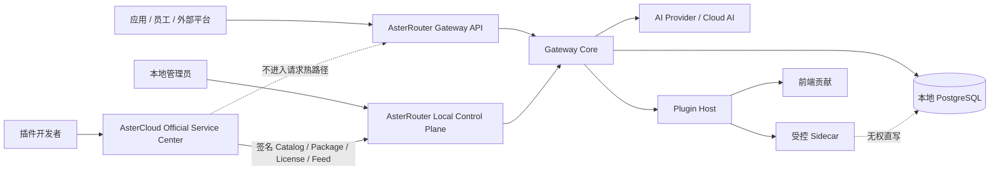

# AsterRouter 产品体系目标文档

## 1. 文档目的

本目录定义 AsterRouter 产品体系的统一目标态，覆盖本地网关、官方服务中心和插件生态。它解决现有资料分散在 README、V1-V4 roadmap、实现代码和多个仓库中的问题，为产品、架构、研发、测试、安全、交付和运营提供共同事实源。

这套文档回答五类问题：

1. AsterRouter 解决什么问题，不解决什么问题。
2. AsterRouter、AsterCloud、官方插件和第三方插件分别拥有哪些事实与责任。
3. 同步文本、多模态、实时会话和异步任务如何通过同一套身份、策略、路由、计量与审计链路。
4. 当前实现如何收敛到目标态，哪些兼容路径需要保留或退出。
5. 每个阶段以什么可执行、可观测、可回滚的标准验收。

本文档不替代 API Reference、运维 Runbook、版本 Changelog 或代码注释。实现细节与本文档冲突时，必须先判断是实现偏离目标，还是文档已经过期；不得静默维持两套口径。

## 2. 基线与状态口径

文档盘点基线为 2026-07-22：

| 仓库 | 盘点基线 | 角色 |
| --- | --- | --- |
| `asterrouter` | `d26a476`，前端版本 `0.18.0`，含工作区未提交插件改动 | 本地可部署 AI 访问与供应平台 |
| `astercloud` | `f726729`，版本 `0.2.0` | 可选官方服务中心 |
| `imagegen` | manifest `0.3.8` | 图片生成前端工作台插件 |
| `videogen` | manifest `0.2.4` | 视频工作台与 Provider Adapter Sidecar |
| `monitorprice` | manifest `0.1.16` | 采购比价与容量情报 Sidecar |
| `provider-trust-plugin` | manifest `0.1.2` | Provider Trust 本地探测与证据插件 |

状态标签统一如下：

| 标签 | 含义 | 使用规则 |
| --- | --- | --- |
| `CURRENT` | 已存在且可从当前代码、测试或部署资产验证 | 可以作为当前交付承诺，但仍须通过发布验收 |
| `TARGET` | 本套文档决定的目标态 | 未完成前不得描述成当前能力 |
| `COMPAT` | 为现有部署或调用方保留的兼容路径 | 只修复安全和正确性问题，不在其上扩展新领域 |
| `DEPRECATED` | 已有替代方案、应停止新增依赖 | 必须提供迁移路径、观测和退出条件 |
| `DEAD` | 无合法调用方或违反核心边界 | 经引用核验后删除，不保留双写或影子实现 |

路线图中的未来设想不自动成为 `TARGET`。只有进入本目录并明确责任、数据归属、迁移和验收后，才构成目标决策。

## 3. 一页产品全景

### 3.1 产品定义

> AsterRouter 是面向企业、AI 平台和服务运营者的可私有部署 AI Access Supply Platform：以稳定的 Gateway API 接入模型供应，以统一策略完成身份校验、路由、容量、成本、用量、产物和审计治理，并通过受控插件扩展场景与供应商能力。

AsterCloud 是 AsterRouter 的可选官方服务中心，不是请求代理，也不是私有部署数据的默认汇聚点。它提供签名目录、插件包、Core 更新、License、Entitlement、安全公告、官方数据服务和开发者审核。

### 3.2 三个责任域

| 责任域 | 拥有的事实 | 明确不拥有 |
| --- | --- | --- |
| AsterRouter Core | Gateway 身份上下文、Provider/Account、模型/路由、策略、任务、Attempt、Usage、Cost、Artifact、审计、本地插件安装状态 | 订单支付、插件市场交易、跨客户云端行为画像 |
| AsterCloud | 官方目录、包与签名、Core Release、安全公告、客户与商业授权、开发者审核、官方数据服务 | 客户 Prompt/Response、Provider Secret、本地 Key、逐请求热路径决策 |
| 插件 | 自身配置、私有业务状态、声明的贡献点和经 Core 授权的操作 | Core 表写权限、Provider Secret 持久化、凭据签发、路由/计量/账本最终裁决 |

### 3.3 核心不变量

1. AsterCloud 中断时，已授权的 AsterRouter 实例仍能在有效离线窗口内处理请求。
2. 插件停机或卸载不能破坏 Core 的身份、路由、用量、账本与审计一致性。
3. 任何 Provider Secret 都只在 AsterRouter 受控边界内解密和使用，不进入浏览器、日志、目录服务或插件持久化。
4. 所有 AI 调用都归一为 `Auth Context -> AIOperation -> AIAttempt -> Usage -> Billing/Cost -> Artifact/Audit`。
5. PostgreSQL 是业务事实源；Redis、文件系统、对象存储索引和本地包目录均可恢复或对账。
6. Direct 与 Durable 是执行通道，不是两套产品模型；模型、策略、计量与权限语义保持一致。
7. 插件声明能力不等于获得权限；安装、授权、配置、运行健康和调用时策略全部通过后才可执行。
8. 客户应收、供应商成本和节省证据分别建模，不用一个倍率覆盖不同商业事实。

## 4. 当前能力与主要缺口

### 4.1 CURRENT

- 四种互斥的首装部署角色：Personal、Relay Operator、Enterprise、Platform。
- OpenAI-compatible `/v1/models`、聊天补全、图片、音频、视频、Job、Artifact 和 Realtime 入口。
- Provider Connection、Provider Account、Gateway Model、Model Route、调度、熔断、冷却和容量控制。
- Workspace/User/Customer/Service Key，Scope、模型与模态白名单、QPS/RPM/TPM/并发、预算和轮换。
- 平台租户、Gateway Principal、外部鉴权集成和 Usage Sink。
- `AIOperation`、`AIAttempt`、Durable Job、公平队列、事务 Outbox、Usage、价格评估、Billing Ledger 和 Artifact 生命周期。
- PostgreSQL 生产 Repository；Redis 可用于队列、Ready Index、容量与亲和；Artifact 支持 Local 与 S3-compatible 存储。
- 签名 Catalog、Package 缓存/安装、兼容性检查、License Snapshot、加密 Feed、插件 API Token、前端贡献和 Sidecar Supervisor。
- AsterCloud 的身份认证、商业授权、兑换码、插件目录、开发者审核、安全公告、Provider Intelligence 和官方服务版本。

### 4.2 TARGET 缺口

- 把当前大量代码能力收敛为稳定公开契约，而不是继续按页面或 Provider 增加特例。
- 为插件协议、Host API、错误码、权限和兼容矩阵建立版本化规范及契约测试套件。
- 将配置变更演进为可预览影响、审批、发布、ACK、回滚的变更集。
- 建立控制面、数据面、后台 Worker 分角色部署与多实例一致性验收。
- 建立端到端 SLO、容量模型、灾备目标和自动恢复演练。
- 统一 AsterRouter 与 AsterCloud 的实例、License、Entitlement、目录和安全撤销状态机。
- 形成插件开发 SDK、审核证据、可复现构建、SBOM、签名和快速撤销闭环。

## 5. 文档导航

| 编号 | 文档 | 主要问题 |
| --- | --- | --- |
| 01 | [产品定位与系统边界](./01-产品定位与系统边界.md) | 产品是谁、服务谁、边界在哪里 |
| 02 | [角色与用户旅程](./02-角色与用户旅程.md) | 每类用户如何完成关键任务 |
| 03 | [业务能力与功能地图](./03-业务能力与功能地图.md) | 能力分层、归属和优先级 |
| 04 | [总体与部署架构](./04-总体与部署架构.md) | 系统组件、部署拓扑和依赖方向 |
| 05 | [核心流程与时序](./05-核心流程与时序.md) | 请求、任务、插件、授权如何流转 |
| 06 | [领域模型与数据归属](./06-领域模型与数据归属.md) | 限界上下文、实体和事实源 |
| 07 | [路由、计量与计费](./07-路由计量与计费.md) | 如何选路、计量、定价与对账 |
| 08 | [多租户、权限与安全](./08-多租户权限与安全.md) | 身份、隔离、Secret 与供应链安全 |
| 09 | [运营、可观测性与 SRE](./09-运营可观测性与SRE.md) | 如何观测、处置、恢复和审计 |
| 10 | [实施路线图与验收](./10-实施路线图与验收.md) | 如何分阶段交付并判断完成 |
| 11 | [术语与口径](./11-术语与口径.md) | 名称、状态和指标如何统一 |
| 12 | [产品需求文档 PRD](./12-产品需求文档-PRD.md) | 产品目标、需求、指标和发布门槛 |
| 13 | [账号体系设计](./13-账号体系设计.md) | 人、组织、机器身份和 Key 如何建模 |
| 14 | [用户故事与用例](./14-用户故事与用例.md) | 可测试的主流程、异常流和追踪矩阵 |
| 15 | [数据库与事件设计](./15-数据库与事件设计.md) | 本地/云端 Schema、事务和演进规则 |
| 16 | [插件体系与开放平台设计](./16-插件体系与开放平台设计.md) | 插件包、生命周期、运行时和开发者契约 |
| 17 | [AsterCloud 官方服务中心设计](./17-AsterCloud官方服务中心设计.md) | 云端目录、授权、数据服务和信任链 |
| 18 | [系统拆分与 MVP 迭代](./18-系统拆分与MVP迭代.md) | 仓库、进程、模块和阶段边界 |
| 19 | [多实例部署与容灾设计](./19-多实例部署与容灾设计.md) | 单机、HA、多 Region 和恢复目标 |

## 6. 建议阅读路径

| 读者 | 推荐顺序 |
| --- | --- |
| 产品与管理者 | README -> 01 -> 02 -> 03 -> 12 -> 10 |
| 架构与研发 | README -> 04 -> 06 -> 05 -> 07 -> 15 -> 16 -> 17 -> 18 |
| 安全与审计 | README -> 08 -> 13 -> 16 -> 17 -> 19 |
| 测试与交付 | README -> 14 -> 10 -> 09 -> 19 |
| 插件开发者 | 01 -> 16 -> 06 -> 08 -> 14 |

## 7. 文档治理

- 决策优先级：本目录中已批准的目标决策 > 当前版本专项设计 > 历史 roadmap；代码仍是 `CURRENT` 行为的最终证据。
- 每次功能变更必须更新受影响文档的状态、接口、数据归属或验收项，不能只更新 README。
- 目标需求使用稳定 ID：`G-*`、`FR-*`、`NFR-*`、`UC-*`、`ADR-*`、`AC-*`。
- 架构图必须表达信任边界和数据方向；示意图不得暗示不存在的同步依赖。
- 指标目标在没有基线前标记为“门槛候选”，建立基线后才能转为发布 SLO。
- 未决策项必须写清 owner、最晚决策点和默认保守行为。
- 每个版本发布前运行链接检查、术语检查、需求追踪检查，并由产品、工程、安全和运维共同审阅涉及其责任的变更。
