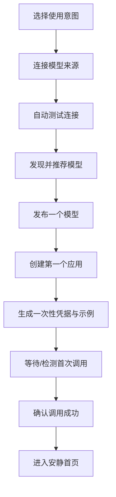

# 核心用户与首日闭环

## 1. 用户优先级

V1 必须有主用户，不能同时为所有角色设计首页。

### 1.1 第一用户：AI 服务负责人

典型身份：企业 AI 平台工程师、技术负责人、独立开发者、API 服务运营者。

他第一次打开 AsterRouter 时只有一个目标：

> 让一个真实应用通过稳定、安全的入口调用一个真实模型。

他愿意提供 Provider Credential，但不应该被要求先配置完整组织、价格、路由组、插件和观测系统。

### 1.2 第二用户：应用负责人

他关心：应用能用哪些模型、Key 是否安全、预算是否正常、最近调用为何失败。他不需要管理 Provider Account 和 Route。

### 1.3 第三用户：平台治理者

他关心组织、策略、成本、安全、审计和异常。高级治理必须完整，但不决定第一用户的首日路径。

### 1.4 专业用户：SRE、FinOps、插件管理员

他们需要精确工程对象和批量能力，从相关业务对象进入 L3 诊断或管理员工具，不共享一个塞满所有功能的首页。

## 2. 首次安装不问架构名词

### 2.1 第一个问题

> 你准备如何使用 AsterRouter？

- **给自己或团队使用**：管理团队应用、模型和成本。
- **向客户或其他系统提供服务**：管理客户应用、访问和用量交付。

默认推荐“给自己或团队使用”。两个选项用一行结果描述，不展示 `/admin`、`/operator` 等 Route。

### 2.2 服务模式的第二个问题

> 客户账号和费用由谁管理？

- **已有业务系统**：AsterRouter 接收外部身份并回传用量。
- **由 AsterRouter 管理**：使用内置客户、余额和套餐能力。

这一步只为服务模式出现。系统据此映射 Platform 或 Relay Operator Profile。

### 2.3 高级安装

熟悉现有模型的部署者可以展开“高级安装”，直接选择 Personal、Enterprise、Platform 或 Relay Operator。高级选择显示不可逆影响和配置摘要，但不作为默认路径。

## 3. 首日闭环



整个路径只有一个主按钮，用户可以退出并恢复进度。

## 4. 步骤一：连接模型来源

### 输入

- 来源类型或常见供应商；
- Base URL，仅在需要时显示；
- Credential；
- 可选名称，默认由系统生成。

### 系统自动完成

- 推导 Auth Type 和默认 Endpoint；
- 校验 URL 与安全策略；
- 测试认证和网络；
- 获取模型清单和能力；
- 建立 Provider Connection 与首个 Provider Account；
- 创建安全容量默认值和健康状态。

### 结果文案

成功：

> 模型来源已连接，可以使用 18 个模型。我们推荐先发布 3 个稳定模型。

失败：

> 无法验证这组凭据。供应商返回“凭据无效”，尚未保存为可用来源。

“查看技术详情”再展示 HTTP 状态、Provider Error 和 request ID。

## 5. 步骤二：发布模型

界面默认只展示推荐模型：最常用、健康、能力已识别且价格信息完整的候选。其余模型通过搜索查看。

用户只需确认：

- 对应用显示的模型名；
- 是否现在发布；
- 可选的用途标签。

系统自动创建 Gateway Model、Model Route 和能力映射。只有多个来源或高级策略存在时，才出现“供应与切换规则”。

成功文案：

> `gpt-4.1-mini` 已发布。来源故障时，AsterRouter 会按规则选择可用来源。

## 6. 步骤三：连接应用

应用是面向用户的顶层对象，代表一个服务、Agent、网站、客户集成或自动化任务。

### 必填

- 应用名称；
- 选择一个或多个已发布模型。

### 默认生成

- Service Gateway Principal；
- 最小 `gateway:invoke` / `models:read` Scope；
- 受限 API Key；
- 合理 QPS、并发和月度预算保护；
- 推荐 Artifact Policy；
- 应用独立 Usage 和 Trace 归属。

高级权限、CIDR、精细预算和轮换设置折叠显示。

## 7. 步骤四：首次调用

界面展示自动生成、可运行的 cURL 和当前可用语言 SDK 示例。示例只包含：Base URL、一次性 Key、已发布模型和最小请求。

```bash
curl "$ASTERROUTER_BASE_URL/v1/chat/completions" \
  -H "Authorization: Bearer $ASTERROUTER_API_KEY" \
  -H "Content-Type: application/json" \
  -d '{"model":"gpt-4.1-mini","messages":[{"role":"user","content":"hello"}]}'
```

页面等待服务器检测对应 Credential 的首次成功 Operation，也允许用户发送内置测试请求。成功后展示：

- 总耗时与首响应时间；
- 使用的已发布模型；
- 应用身份与权限已生效；
- Usage 和 Trace 已记录；
- “进入首页”主按钮。

不在成功页展示 Provider Account ID、Route ID、Attempt ID 或价格表达式。

## 8. 中断与恢复

Onboarding Session 保存当前步骤和已创建对象引用，不保存 Provider Secret 或 Key 明文。

- 浏览器刷新后回到未完成步骤。
- Provider 已保存但测试失败时允许修正，不重复创建 Connection。
- Model 已发布但应用未创建时继续下一步。
- Key 明文丢失时只允许轮换，不尝试恢复。
- 首次调用一直未发生时，用户可以跳过并在首页看到“应用尚未连接”。

## 9. 升级用户的首次进入

现有实例不进入全新安装流程。系统根据已有事实生成迁移摘要：

```text
已发现：
  6 个可用模型来源
  12 个已发布模型
  28 个活跃访问凭据
  3 个需要确认归属的个人 Key

我们已为你生成新的“模型”和“应用”视图，Gateway API 与 Key 保持不变。
```

无法自动归属的 Key 进入一次性整理任务，但不阻塞数据面和其他管理操作。

## 10. 日常核心旅程

### 10.1 新应用接入

`应用 -> 新建应用 -> 选择模型 -> 创建凭据 -> 首次调用`。

### 10.2 增加备用来源

`模型 -> 选择模型 -> 供应 -> 添加来源 -> 自动测试 -> 模拟影响 -> 启用`。

### 10.3 处理故障

`今天 -> 待处理事项 -> 查看影响 -> 执行推荐动作 -> 验证恢复`。

### 10.4 轮换凭据

`应用 -> 访问 -> 轮换 -> 查看旧凭据最后使用 -> 完成轮换`。

### 10.5 查看费用

`用量 -> 按应用/模型查看 -> 识别异常 -> 设置预算或打开活动详情`。

## 11. 首日闭环验收

- 默认路径最多四个业务步骤，不要求进入主导航的其他页面。
- 用户无需理解 Profile、Provider Account、Gateway Principal、Route 和 Policy。
- 每一步失败都说明原因、是否已保存、如何继续。
- 成功调用产生真实 Operation、Attempt、Usage 和 Trace，不使用演示假数据。
- 完整 Key 只出现一次，示例默认采用环境变量，不鼓励写入源码。
- 用户退出 Onboarding 后，所有对象均可在“应用”和“模型”找到。
