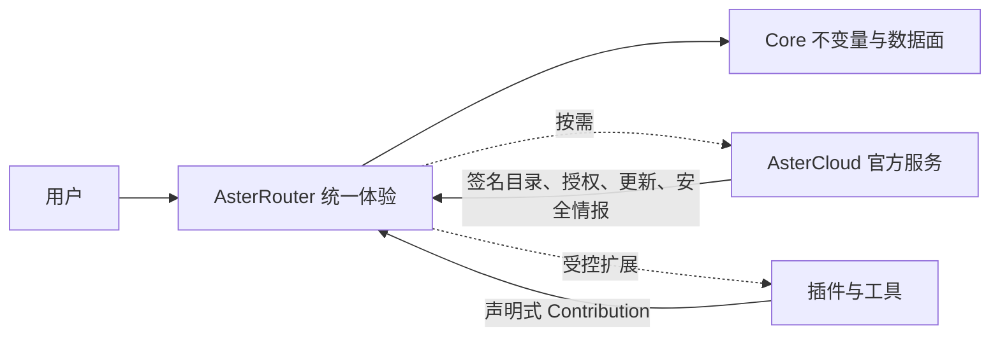

# Core、AsterCloud 与插件产品边界

## 1. 用户只需要理解一个产品

对实例使用者，产品名是 AsterRouter。Core、AsterCloud 和 Plugin Host 是实现边界，不应变成日常导航中的三个产品。



简单体验不能模糊责任：Core 最终裁决，AsterCloud 可选，插件受限。

## 2. Core 的产品责任

Core 是 AsterRouter 可独立工作的最小完整产品，拥有：

- 身份、Tenant、Role、Scope 和 Policy 裁决；
- Gateway 协议、模型、Route、调度、重试与容量；
- Provider Secret 和 Credential 生命周期；
- Operation、Attempt、Usage、Pricing Evaluation、Ledger 与 Audit；
- Job、Artifact 和幂等状态机；
- Attention Item 所需的本地事实与动作；
- Plugin Host、权限授予和 Contribution 最终校验。

以下请求不得依赖 AsterCloud 在线，也不得被普通插件接管：

- 每次 Gateway Admission 和身份验证；
- Route 最终选择与 Provider Credential 解密；
- Usage 记账、余额裁决和审计写入；
- Job/Artifact 状态提交；
- 插件权限和输出的最终验证。

## 3. AsterCloud 的产品责任

AsterCloud 是可选官方服务中心，只在用户需要以下结果时出现：

| 用户需要 | AsterCloud 提供 | AsterRouter 中的呈现 |
| --- | --- | --- |
| 安装可信扩展 | 签名 Catalog、Package、兼容记录 | 扩展管理 |
| 获取更新 | Core/Plugin Release 元数据 | 系统更新事项 |
| 处理安全风险 | Advisory、撤销与修复版本 | 安全待处理事项 |
| 使用付费能力 | Entitlement、License、离线授权文件 | 对应能力的授权状态 |
| 发布插件 | Developer Project、审核、签名与发布 | 开发者进入 AsterCloud |
| 获取供应情报 | 签名 Feed、价格与信任数据 | 模型来源或工具内的更新时间 |

AsterCloud 不得：

- 接收 Provider Secret、应用 Key 或请求内容作为默认行为；
- 逐请求参与 Gateway、Policy、Route 或账务裁决；
- 远程执行实例命令、静默安装插件或修改本地配置；
- 在断网后让有效本地 License 和已安装能力立即失效；
- 用云端账号替代实例本地管理员和审计边界。

### 3.1 出现时机

AsterCloud 只在更新、授权、安全事项和扩展发现中出现。状态正常时，不在首页长期放置“连接云端”推广卡片。

相关文案以结果表达：

- “图片工作台有可用更新”；
- “Provider Trust 授权将在 14 天后到期”；
- “已安装版本受安全公告影响”；
- “官方服务暂时不可达，现有调用不受影响”。

## 4. 插件的两种身份

### 4.1 对普通用户：工具或能力

安装后按真实用途出现：

| 技术插件 | 普通用户看到 |
| --- | --- |
| ImageGen Workbench | 图片工作台 |
| VideoGen Workbench | 视频工作台 |
| MonitorPrice | 供应比价 |
| Provider Trust | 来源可信度 |
| Provider Adapter | “连接模型来源”中的来源类型 |
| Notification | 通知设置中的送达方式 |
| Artifact Sink | 数据与产物设置中的存储目标 |

普通用户无需知道 Runtime、Manifest、Sidecar 和 Package Digest。

### 4.2 对管理员：受控扩展

管理员在“扩展管理”中查看来源、版本、签名、权限、兼容性、健康、更新和数据占用。安装、启用、授权、禁用、卸载和清除数据是不同动作。

插件不能自行：

- 增加一级导航；
- 修改全局品牌、布局和权限文案；
- 创建绕过 Attention Item 的全局弹窗；
- 读取未声明的 Core 数据或其他插件数据；
- 扩大 CSP、网络和 Secret 权限；
- 直接写 Core 数据库或裁决账务。

## 5. Contribution 的产品归位

| Contribution 类型 | 产品位置 | 规则 |
| --- | --- | --- |
| 独立工作台 | “工具” | 仅有真实用户任务时出现 |
| 模型来源 Adapter | 连接来源流程 | 不显示为单独插件页 |
| 模型/用量 Widget | 对应对象详情 | Host 决定位置、尺寸和加载状态 |
| Notification | 设置 / 通知 | 只获得授权事件和目标出站 |
| Artifact Sink | 设置 / 数据与产物 | 异步，不改变 Core Artifact 事实 |
| Report/Export | 用量 / 导出 | 查询受 Scope 与资源配额限制 |
| Provider Intelligence | 模型来源详情 | 标明数据时间与来源，不替代本地健康 |

同一个 Contribution 不能同时在主导航、首页卡片和对象页重复占位。

## 6. 安装与授权体验

安装页先说明插件给用户带来什么，再展示技术信息：

1. 能完成的任务；
2. 将出现在哪里；
3. 需要访问哪些数据和网络；
4. 数据是否离开实例；
5. 版本、发布者、签名与兼容性；
6. 安装后是否还需配置或 License。

新增 Permission 的升级不能无感完成。确认页显示新旧权限差异，不用笼统的“权限已变化”。

高权限插件支持先安装不启用，由安全管理员授权后再启用。安装失败不留下半启用导航或运行进程。

## 7. 故障与降级

| 故障 | 用户体验 | Core 行为 |
| --- | --- | --- |
| AsterCloud 不可达 | 显示最后同步时间；无影响时保持安静 | 使用 Last-known-good Catalog/License/Feed |
| Catalog 过期 | 只阻止不安全的新安装或更新 | 现有有效插件按策略运行 |
| License 进入宽限期 | 在影响前生成授权事项 | 本地验签并遵循 Grace 规则 |
| 工作台前端加载失败 | 工具页可重试，不影响其他页面 | 隔离前端 Contribution |
| Sidecar 崩溃 | 表达受影响工具/模型任务 | Supervisor 退避、熔断并保留 Core 正确性 |
| Provider Adapter 超时 | 模型供应显示降级 | Core 依据 Route 选择其他候选 |
| Usage Sink 失败 | 用量交付事项显示积压数量 | Outbox 重试，不丢本地 Usage |
| 恶意版本被撤销 | 高优先级安全事项 | 按本地策略阻止安装、隔离或禁用 |

任何降级文案都必须区分“管理功能不可用”和“Gateway 调用受影响”。

## 8. 离线自治

离线不是异常边角，而是边界验收场景：

- 未连接 AsterCloud 的实例可以完整使用 Core；
- 已安装、已授权且不依赖远端数据的工具继续运行；
- 离线 Package 和 Catalog Snapshot 可导入、验签和审计；
- License 使用签名文件、本地时间策略和明确宽限期；
- Feed 显示最后更新时间，过期数据不伪装成实时事实；
- 恢复联网后增量同步，不覆盖本地配置和管理员决策。

## 9. 数据与隐私边界

默认数据流：

```text
业务请求 -> AsterRouter Core -> 已选择的 Provider
                  |
                  +-> 本地 Usage / Trace / Audit / Artifact Policy
```

AsterCloud 和插件不在默认请求链上。任何需要向插件或官方服务发送数据的能力必须：

- 在 Manifest/产品页声明字段、目的、目标域和保留时间；
- 获取与风险相称的管理员授权；
- 对 Secret、请求内容和个人数据使用最小化与脱敏；
- 提供停用、导出和删除路径；
- 在本地 Audit 中记录主体、版本、动作和结果。

## 10. 发布与兼容

AsterRouter、AsterCloud 和插件独立发布，但共同遵守兼容矩阵：Core SemVer、Host Protocol、Package Format、Contribution API、Profile/Surface、OS/Arch 和数据 Schema。

- Core 发布前运行官方插件 Conformance Suite；
- 插件发布前验证最低 Core 版本和所有声明 Surface；
- AsterCloud 只发布不可变 Digest 的签名资产；
- 破坏性协议升级提供并行版本和迁移窗口；
- 新 UI 不按插件 ID 写业务分支，按 Capability 与 Contribution 渲染。

## 11. 边界验收

- 断开 AsterCloud 后，现有 Gateway、Usage、账务和已授权工具仍按规则运行。
- 禁用任一插件不破坏 Core，也不留下可点击的失效导航。
- 插件无法访问未授权 Tenant、Secret、数据库和网络目标。
- AsterCloud 无法远程改变本地 Route、Policy 和插件启用状态。
- 普通用户完成图片、视频或供应治理任务时，无需理解插件运行时。
- 安全管理员能追溯 Package、Digest、Permission、License 和所有生命周期动作。

完整工程约束继续以 [总体与部署架构](../../goal/04-总体与部署架构.md) 和 [插件体系与开放平台设计](../../goal/16-插件体系与开放平台设计.md) 为准。
