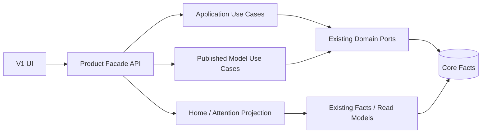

# 领域投影与 API 重构

## 1. 重构目标

新体验需要按用户任务聚合数据，但不能建立一套与 Core 并行的业务模型。V1 采用应用层 Facade、只读投影和场景命令：



Facade 负责组合和流程编排，不拥有 Route、Credential、Usage 或账务事实。

## 2. 设计原则

1. **稳定根对象。** `Application` 使用 Principal ID，`PublishedModel` 使用 Gateway Model ID。
2. **写入回到所有者。** 每个字段通过现有领域用例修改，不直接更新聚合查询结果。
3. **一次场景命令。** UI 不再串行调用六个 CRUD Endpoint 完成一个用户动作。
4. **幂等与可恢复。** 跨对象命令带 Idempotency Key，并返回阶段与已完成结果。
5. **不隐藏部分失败。** 聚合读取标明新鲜度和缺失区块；命令说明哪些步骤已经生效。
6. **权限先于聚合。** Repository 和服务端对每个来源事实执行 Tenant/Scope 过滤。
7. **Facade 保持薄。** 编排现有端口，不复制 Scheduler、Policy、Pricing 和 Job 状态机。

## 3. Application 投影

### 3.1 定义

```text
Application
  = Principal（稳定根）
  + Credential Summary
  + Effective Policy / Model Scope
  + Budget and Rate Limits
  + Usage Summary
  + Integration Status
  + Attention Summary
```

建议字段：

| 字段 | 来源 | 可写方式 |
| --- | --- | --- |
| `id`、`name`、`status`、`owner` | Principal | Principal 用例 |
| `allowed_models` | Policy/Scope 有效结果 | Policy 命令 |
| `credentials` | Key/Credential 摘要 | 创建、轮换、撤销命令 |
| `budget`、`limits` | Policy/Budget | 治理命令 |
| `last_used_at`、`usage` | Usage 聚合 | 只读 |
| `integration` | Tenant/Integration 配置 | 集成用例 |
| `attention_count` | Attention 投影 | 只读 |

`Application` 不存 Provider Secret，不返回 Key 明文。新建 Application 可以在一个事务/工作流中创建 Principal 和默认 Policy；Credential 明文作为一次性命令结果返回。

### 3.2 无法归属的历史 Key

历史 Key 可能没有明确业务应用语义。迁移时：

- Principal 唯一且有名称：直接以 Principal 作为 Application；
- 多个 Key 属于同一 Principal：展示为同一 Application 的多个 Credential；
- 个人 Key 或共享 Principal 无法拆分：创建 `ownership_review` Attention Item；
- 不自动复制、重新签发或撤销 Key；
- 用户整理后只修改归属元数据或 Principal 关系，保留审计。

## 4. PublishedModel 投影

### 4.1 定义

```text
PublishedModel
  = Gateway Model（稳定根）
  + Capability
  + Eligible Routes
  + Supply Health and Capacity
  + Application Reach
  + Usage / Cost Summary
```

| 字段 | 来源 | 说明 |
| --- | --- | --- |
| `id`、`public_name`、`status` | Gateway Model | 公开协议保持不变 |
| `capabilities` | Model Capability | 显式声明与发现结果分开 |
| `supply` | Route + Account + Health | 展示有效候选与降级原因 |
| `applications` | Effective Policy | 只返回有权查看的摘要 |
| `usage`、`cost` | Usage/Pricing | 标明币种、时间和未知成本 |
| `attention` | Alert/Health 投影 | 按影响聚合 |

“发布模型”命令创建或启用 Gateway Model，并用安全默认创建首个 Route。后续添加供应使用独立命令，先验证能力、价格和路由影响。

## 5. AttentionItem 投影

### 5.1 定义

```text
AttentionItem
  = source fact(s)
  + impact calculation
  + recommended action
  + user disposition
```

来源包括 Alert、Risk、Credential Expiry、Budget Threshold、Provider Health、Job/Delivery Failure、License/Advisory 和迁移整理任务。

建议字段：

| 字段 | 说明 |
| --- | --- |
| `id` | `type + source namespace + stable source id + impact scope` 的稳定摘要 |
| `severity` | 依据业务影响和时间计算 |
| `title`、`impact` | 本地化表达，不替代原始错误 |
| `source_refs` | 指向 Alert、Trace、Job、Plugin 等证据 |
| `recommended_action` | 受控动作类型和参数 Schema |
| `status` | open、in_progress、resolved、ignored、snoozed |
| `due_at`、`resolved_at` | 截止与结果时间 |
| `freshness` | 来源数据最后计算时间 |

AttentionItem 可以由读取时计算或异步物化。用户的忽略、延后和处理记录是新的协调事实，但原始 Alert/Job/Expiry 仍是事实源。

### 5.2 聚合与消歧

- 同一 Provider 故障按 PublishedModel 和共同动作聚合；
- 一个应用的多次同根失败不生成重复事项；
- 系统自动恢复后关闭事项并保留时间线；
- 来源冲突时显示“状态正在确认”，不选择看起来更乐观的数据；
- 严重安全 Advisory 不能被普通忽略策略永久关闭。

## 6. OnboardingSession

OnboardingSession 是短期流程协调状态，不是新的配置事实。它只保存：

- 当前步骤和状态；
- 已创建的 Connection、Gateway Model、Principal ID；
- 幂等键、失败阶段和恢复提示；
- 创建者、Tenant、过期时间和审计引用。

它不保存 Provider Secret、Key 明文、完整请求内容。Session 过期不删除已经创建的领域对象。

## 7. Home 投影

`GET /api/v1/home` 返回一个已经做出优先级判断的首页投影，而不是让浏览器拼接十几个 Endpoint：

```json
{
  "conclusion": {
    "status": "attention",
    "message_key": "home.two_items_need_attention"
  },
  "attention": [],
  "onboarding": null,
  "recent_changes": [],
  "summary": {
    "active_applications": 3,
    "published_models": 5,
    "calls_24h": 12840
  },
  "freshness": {
    "usage_as_of": "2026-07-23T08:00:00Z",
    "health_as_of": "2026-07-23T08:00:05Z"
  }
}
```

服务端返回结构化 `message_key + params` 或受控文案字段，避免浏览器依据错误码自行发明不同解释。

## 8. 建议 API

### 8.1 首页与事项

| 方法 | 路径 | 用途 |
| --- | --- | --- |
| `GET` | `/api/v1/home` | 首页结论与摘要 |
| `GET` | `/api/v1/attention-items` | 分页、筛选待处理事项 |
| `GET` | `/api/v1/attention-items/:id` | 影响、证据和时间线 |
| `POST` | `/api/v1/attention-items/:id/actions` | 执行推荐动作 |
| `POST` | `/api/v1/attention-items/:id/disposition` | 忽略、延后或恢复 |

### 8.2 首次接入

| 方法 | 路径 | 用途 |
| --- | --- | --- |
| `POST` | `/api/v1/onboarding/sessions` | 创建或恢复 Session |
| `GET` | `/api/v1/onboarding/sessions/:id` | 查询阶段与已创建结果 |
| `POST` | `/api/v1/onboarding/sessions/:id/model-source` | 验证并连接来源 |
| `POST` | `/api/v1/onboarding/sessions/:id/published-model` | 发布推荐模型 |
| `POST` | `/api/v1/onboarding/sessions/:id/application` | 创建应用与一次性凭据 |
| `POST` | `/api/v1/onboarding/sessions/:id/verification` | 发送或等待真实调用 |

### 8.3 应用

| 方法 | 路径 | 用途 |
| --- | --- | --- |
| `GET/POST` | `/api/v1/applications` | 查询或创建应用聚合 |
| `GET/PATCH` | `/api/v1/applications/:id` | 详情或修改根属性 |
| `POST` | `/api/v1/applications/:id/credentials` | 创建/开始轮换凭据 |
| `POST` | `/api/v1/applications/:id/credentials/:credentialId/revoke` | 撤销凭据 |
| `PUT` | `/api/v1/applications/:id/access` | 更新模型范围与限制 |
| `GET` | `/api/v1/applications/:id/activity` | 统一活动时间线 |
| `GET` | `/api/v1/applications/:id/integration-example` | 生成无明文 Secret 的示例 |

### 8.4 模型与用量

| 方法 | 路径 | 用途 |
| --- | --- | --- |
| `GET/POST` | `/api/v1/published-models` | 查询或发布模型 |
| `GET/PATCH` | `/api/v1/published-models/:id` | 模型详情与根属性 |
| `POST` | `/api/v1/published-models/:id/supplies:validate` | 模拟新增来源影响 |
| `POST` | `/api/v1/published-models/:id/supplies` | 添加并启用来源 |
| `GET` | `/api/v1/model-sources` | 来源列表与健康摘要 |
| `GET` | `/api/v1/usage/summary` | 按产品口径聚合用量 |
| `GET` | `/api/v1/usage/breakdown` | 应用、模型等维度明细 |

现有精细 CRUD 和诊断 API 继续服务 L2/L3 与兼容客户端，不要求一次性替换。

## 9. 命令语义

所有创建、轮换、发布、启用和处理命令要求：

- `Idempotency-Key`；
- Actor、Tenant、Profile Context 和审计原因；
- 乐观并发版本或 ETag；
- 明确同步/异步结果；
- `completed_steps`、`pending_steps` 和可恢复错误；
- Secret 字段单独传输、脱敏日志和一次性响应；
- 领域事件或 Outbox 保证副作用最终送达。

跨对象流程不强求一个数据库长事务。不可原子完成时使用可恢复 Saga，并为每一步定义补偿或安全停留状态。

## 10. 查询性能与一致性

- 首页与列表使用专用只读查询，避免浏览器 N+1；
- 健康、Usage 和账务允许不同新鲜度，但必须分别标记；
- 强一致配置结果从主事实读取，不能因投影延迟显示保存失败；
- 列表游标排序字段稳定，默认按状态优先级与最近使用；
- 大规模 Usage、Trace 和 Audit 不在聚合 API 中返回无界明细；
- Attention 异步物化失败时，可降级为来源事项列表并标明计算延迟。

## 11. 权限模型

Facade 不定义一套新的粗粒度权限。每个返回区块和命令映射到现有 Scope：

- 无 Usage 权限时 Application 详情不返回费用，而不是拒绝整个应用页；
- 无 Secret 管理权限时不能创建 Credential，摘要仍可见；
- Tenant 管理员只能看到所属 Application、Usage 和 Attention；
- 插件 Contribution 通过 Host 委托 Scope，不获得 Facade 内部超级权限；
- 聚合响应不得通过计数、错误或耗时泄露其他 Tenant 的存在。

## 12. 兼容与演进

- V1 API 以新增 Facade 为主，不重命名现有公开 Gateway API；
- Product API 采用版本化 Schema、枚举兜底和 Contract Test；
- 旧 UI 与新 UI 可在迁移期读取相同 Core 事实；
- 新聚合字段先只读上线，再逐步承接命令；
- 删除旧 CRUD 端点必须独立评估外部调用者，不能随旧页面删除；
- Facade 的任何缓存都不缓存 Key 明文或 Provider Secret。

## 13. API 验收

- 一个首次接入流程可在中断后恢复，不重复创建可用对象。
- 新旧读取对 Principal、Key、Model、Route、Usage 的关键口径一致。
- 并发轮换、重复发布和网络重试不会产生重复有效 Credential 或 Route。
- 聚合接口在部分依赖失败时返回明确区块状态，不伪装完整成功。
- 负向 Tenant、Scope、Secret 和越权测试覆盖所有聚合字段。
- Facade 不包含 Scheduler、Policy、Pricing 或 Plugin Runtime 的复制实现。
