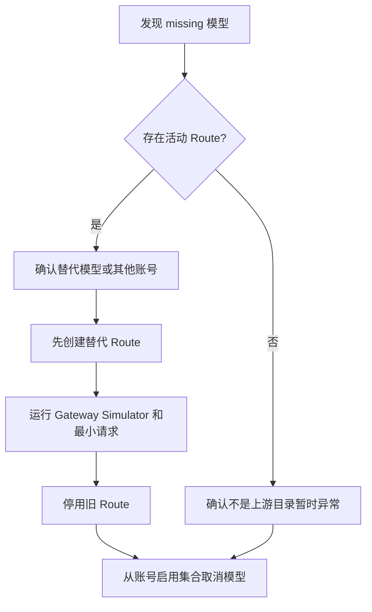

# 模型更新与运维指南

> 适用范围：Provider Account 模型库存、公共 GatewayModel、ModelRoute 和所有模型授权表单。
> 核心规则：供应商模型列表不得硬编码到前端、后端常量或迁移脚本。

## 1. 日常新模型更新

新模型正常情况下不需要发布 AsterRouter 新版本。

1. 进入“路由资源”，新建或编辑目标 Provider Account。
2. OpenAI、Anthropic、Gemini compatible 账号可在“上游模型库存”点击“发现模型”；检查新增、缺失和受影响 Route，勾选启用集合后点击“发现并应用”。
3. AWS Bedrock、GCP Vertex、Azure OpenAI 或无目录私有上游直接添加账号真实使用的 model ID、publisher model/version 或 deployment name，并由向导保存。
4. 检查 `available`、`missing`、`unverified` 状态；手工云目录保持 `manual/unverified`，不代表不可调用。
5. 若要对客户端公开该模型，在“网关模型”创建或选择稳定公共模型 ID。
6. 在“模型路由”使用“批量匹配模型”，复核 route group、优先级和权重后提交。
7. 用 Gateway Simulator 检查候选和调度结果，再发送最小真实请求。

账号库存与可执行路由不是同一事实。当前版本中，embedding deployment 可以保留在库存但不会出现在可执行 Route Checklist；Azure 图像、Vertex/DashScope/混元/BytePlus 等媒体模型只有在对应 Provider Adapter 声明能力后才能运行；内置同步音频与 Realtime 只使用 `openai_compatible` 账号。

创建或启用 `GatewayModel` 后，管理员 Key、Platform Key、外部集成、Operator 使用方 Key、治理策略、个人控制台、Simulator、模型定价和有效价格切换决策会在下次加载时自动读取最新目录，不需要修改任何前端推荐数组。

推荐默认：

- `auto_enable_new_models=false`
- 先确认 Account 库存、后审核、再创建 Route
- 公共模型 ID 使用稳定名称，不直接暴露带日期的供应商部署名，除非产品明确需要固定版本

### 1.1 各页面读取哪个事实源

| 页面或能力 | 唯一模型来源 |
| --- | --- |
| Provider 连接列表 | `ProviderConnection` 类型、Base URL 和连接状态；不含模型或凭据 |
| Provider 账号与 Route | `ProviderAccountModel` 库存和 `ProviderAccount.models` 启用集合 |
| Key、外部集成、治理策略 | active `GatewayModel.model_id` |
| Console curl 示例、Simulator、模型定价 | active `GatewayModel.model_id` |
| 有效价格切换决策 | active `GatewayModel.model_id` |
| 采购价格、第三方账单、缓存能力和探针 | 所选 `ProviderAccount.models`；历史证据保留原值 |
| Portal / Customer / Account 接入配置 | 后端 Workspace 响应中的可访问 GatewayModel |

编辑既有记录时，下线的 GatewayModel 会显示为历史模型。只有管理员显式移除并保存后，旧授权才会改变。Provider 连接表单不能手工录入模型；需要手工补充的上游模型只能进入具体 Provider 账号库存。

allowlist/denylist 在数据库中保留字符串软引用，以支持历史记录和先策略后目录的自动化部署；它们不会让未知模型可调用。网关请求仍必须先成功解析 active GatewayModel，再匹配 active ModelRoute 和账号启用库存。

## 2. 自动启用模式

只有支持数据面目录发现并满足以下条件时才开启“自动启用新发现模型”：

- 该账号的 `/models` 目录可信且稳定。
- 新增账号模型不会绕过客户模型授权。
- 没有依赖严格模型白名单的合规边界。
- 运维接受健康检查扩大 `ProviderAccount.models`。

自动模式只更新账号启用集合，不会自动创建 `GatewayModel` 和 `ModelRoute`，因此新模型不会仅凭一次健康检查直接暴露给客户端。

关闭自动模式不会删除已经启用的模型。需要在库存编辑器中显式取消启用。

## 3. 上游目录不完整或不支持发现

以下情况使用“添加自定义模型”：

- AWS Bedrock model/inference profile、Vertex publisher model/version 或 Azure OpenAI deployment 不能用当前数据面身份可靠枚举。
- 中转站 `/models` 隐藏套餐模型或返回不完整。
- 私有部署没有实现 OpenAI-compatible `/models`。
- 模型需要特殊名称，但上游目录尚未同步。

手工模型状态为 `manual/unverified`。这不表示模型不可用，只表示 AsterRouter 没有目录证据。创建 Route 后应通过 Gateway Simulator 和最小请求验证。

不要为了让页面“看起来完整”批量复制公开厂商列表。只添加账号真实可调用的模型。

## 4. 模型下线处理

发现结果中的 `missing` 是告警，不是删除命令。



处理顺序：

1. 记录发现时间、上游响应和受影响 Route IDs。
2. 排除短时目录故障、权限变化和分页异常。
3. 先增加替代 Route，再停用旧 Route。
4. 最后从账号启用集合移除模型。
5. 保留库存记录和最后发现时间用于审计。

不要直接删除公共 `GatewayModel`。删除公共模型会影响客户端契约，应采用停用和迁移窗口。

## 5. 公共模型与上游模型如何命名

示例：

```text
GatewayModel.model_id = gateway-chat-stable
ModelRoute.upstream_model = provider-chat-versioned
ModelRoute.provider_account_id = account-provider-primary
ModelRoute.route_group = default
```

原则：

- 公共 ID 表达产品承诺。
- 上游 ID 表达供应商真实调用参数。
- 同一公共模型可以有多个 Provider Account Route。
- 固定版本和滚动别名要分开建模，不在请求时做字符串猜测。
- route group 用于明确的隔离或版本策略，不把 Provider 名称编码进公共模型 ID。

## 6. 批量创建 Route

“批量匹配模型”执行以下规则：

1. 从所选账号的已启用模型生成候选行。
2. `upstream_model == GatewayModel.model_id` 时自动匹配。
3. 已存在的等价 Route 自动标记并排除。
4. 未同名模型必须人工选择公共模型。
5. 统一设置 route group、priority 和 weight。
6. 前端提交所选行；后端重新验证全部外键、账号模型和重复项。
7. 任意一行失败则整批不写入。

后端还会拒绝把 active Route 绑定到 disabled `GatewayModel`。历史映射如需保留，应保持 Route 为 disabled；恢复流量前必须先重新启用公共模型并复核客户端契约。

单批上限为 500 条。更大变更应按账号或 route group 拆分，以便审核和回滚。

## 7. 新增 Provider Discovery Adapter

只有 Provider 存在安全、可验证的数据面模型目录 API 时才新增 adapter。Adapter 只服务 Account 库存发现和 Account 健康检查；Provider Connection 不保存模型快照或凭据。

代码位置：

```text
backend/internal/controlplane/provider_account_model_service.go
backend/internal/controlplane/provider_account_model_service_test.go
```

实施步骤：

1. 确认官方目录 endpoint、认证 Header、分页、限流和模型 ID 语义。
2. 实现 `providerModelDiscoveryAdapter`，不要把密钥写入 URL、日志或错误响应。
3. 在 `providerModelDiscoveryAdapterFor` 注册现有 `ProviderConnection.type`。
4. 将返回名称规范化为网关实际转发时使用的 `upstream_model`。
5. 使用标准 JSON 解析，不用字符串截取。
6. 复用或保持以下防护：15 秒超时、2 MiB 单页限制、100 页上限、禁止重定向。
7. 添加分页、空列表、非 2xx、无效 JSON、超大响应和重定向泄密测试。
8. 验证健康检查在 `auto_enable_new_models=false/true` 两种模式下的行为。
9. 更新本文件的 Adapter 覆盖表和运维说明。

禁止：

- 根据 Provider 名称猜测模型列表。
- 把 API Key 放进 query string，除非上游只支持该方式且经过单独安全评审。
- 在 adapter 中直接创建公共模型或 Route。
- 将“目录没返回”解释成“立即删除”。

## 8. Provider 特殊说明

| 类型 | 运维说明 |
| --- | --- |
| `openai_compatible` | Base URL 应指向包含 `/models` 的 API 版本根路径，例如 `/v1` |
| `anthropic_compatible` | Base URL 通常指向 `/v1`；adapter 使用 `x-api-key` 和官方版本 Header |
| `gemini_compatible` | Base URL 通常指向 `/v1beta`；库存 ID 会移除响应中的 `models/` 前缀 |
| `aws_bedrock` | 手工维护 model ID 或 inference profile ID；Region 和端点属于 Account adapter config |
| `gcp_vertex` | 手工维护 publisher model/version；Project、Location 和端点属于 Account adapter config |
| `azure_openai` | 手工维护 deployment name；API version、audience 和 Managed Identity client ID 属于 Account adapter config |

## 9. 数据库迁移与部署

迁移文件：

```text
backend/migrations/065_provider_account_model_inventory.sql
backend/migrations/068_multi_cloud_protocol_routing.sql
```

部署前：

1. 备份 PostgreSQL。
2. 在隔离数据库运行全部 migration schema tests。
3. 确认所有应用实例进入同一维护窗口；068 会删除连接级模型和 Secret 字段，旧实例不能与新 Schema 混跑。
4. 在隔离环境验证升级后，一次迁移并切换全部实例，不做新旧版本双轨运行。

065 保留 `provider_accounts.models` 作为 Account 启用快照，库存表首次读取为空时会把旧列表投影为 `manual/unverified`。068 将连接级 Secret 迁入现有 Account，删除连接级模型/Secret，并为 Route 回填显式上游格式；无法唯一推导的 Route 会被禁用并记录原因。

## 10. 回滚

068 是硬切换迁移，应用层回滚必须使用迁移前备份恢复完整 Schema 与数据，不能把旧二进制直接指向新 Schema。业务配置回退可以执行：

1. 关闭所有账号的自动启用开关。
2. 恢复账号原启用模型集合。
3. 停用本次新增 Route，不要先删除。
4. 用 Simulator 确认旧 Route 恢复为候选。
5. 仅当数据库也从迁移前备份恢复后，才切换到旧应用版本。

不要在紧急回滚时手工补列或执行 `DROP TABLE`；数据库结构回退应使用已验证的备份恢复流程，并单独评审。

## 11. 排障

### 发现返回 401/403

- 确认 Account Secret 能解密，且认证方式与 Provider 类型匹配。
- 检查 Header 方式与 Provider 类型是否匹配。
- 确认账号具备读取模型目录的权限。

### 发现返回 404

- 检查 Base URL 是否已经包含 `/v1` 或 `/v1beta`。
- 不要把 completion endpoint 填为 Base URL。
- AWS Bedrock、GCP Vertex 和 Azure OpenAI 应使用手工库存模式，不要伪造 `/models`。

### 大量模型突然 missing

- 先视为目录或权限事故，不要批量停用。
- 检查上游分页字段是否变化。
- 对比最近 Account 健康检查和 Provider 状态。
- 保留受影响 Route，等待替代路径验证完成。

### 新模型已启用但客户端不可见

账号库存不是公共目录。继续检查：

1. 是否存在 active `GatewayModel`。
2. 是否存在匹配 route group 的 active `ModelRoute`。
3. Route 的 `upstream_model` 是否仍在账号 `models` 中。
4. 账号是否 active、schedulable、未冷却且有容量。

### 批量 Route 整批失败

错误会标识 `routes[index]`。修正该行后重试；事务保证此前没有部分写入。常见原因是重复 Route、账号未启用上游模型、GatewayModel 不存在或已停用、Provider/模态/上游格式能力不匹配、权重超出 `1..10000`。

### 需要暂时停用账号全部模型

Compatible 账号在库存编辑器点击“清空已启用模型”，再点击“发现并应用”。手工云目录账号清空模型后使用向导“保存”。两种路径都会原子保存空启用集合并保留已有库存证据和 Route 计数；无需删除 Provider Account，现有 Route 因上游模型不再暴露而不会成为候选。

## 12. 验证命令

后端快速验证：

```bash
cd backend
go test ./internal/controlplane ./internal/server -count=1
go test -race ./internal/controlplane ./internal/server
```

PostgreSQL 迁移验证：

```bash
cd backend
ASTER_TEST_DATABASE_URL='postgres://...' go test ./migrations -count=1
```

前端验证：

```bash
cd frontend
npm run test:unit
npm run typecheck
npm run build
npm run check:enterprise-surface
```

生产代码硬编码扫描：

```bash
rg -n --glob '!**/*_test.go' --glob '!**/*.test.ts' \
  '(gpt-[0-9]|claude-(opus|sonnet|haiku|[0-9])|gemini-[0-9]|grok-[0-9])' \
  backend/internal frontend/src
```

扫描结果应为空。协议名、客户端产品名、测试夹具和 Provider 身份前缀规则不属于运行时模型目录，必须人工判断，不能机械删除。

浏览器至少验证：

- `1440x900`、`1280x800`、`390x844`
- 中文和英文
- 明色和暗色主题
- 键盘焦点、表格横向滚动、弹窗纵向滚动
- 新增、missing、手工模型和批量 Route 状态

## 13. 更新检查清单

- [ ] 模型来自账号实时发现或明确手工证据
- [ ] 没有新增硬编码供应商模型数组
- [ ] Provider 连接模型仅来自健康检查快照，表单不能手工编辑
- [ ] Key、策略、集成、Console、Simulator 和定价只读取 active GatewayModel
- [ ] Route 和有效价格切换决策只选择 active GatewayModel
- [ ] 采购价格、账单、缓存能力和探针读取账号启用模型，不读取 Provider 快照
- [ ] 旧记录中的下线模型被标记为历史值，没有静默删除
- [ ] 新模型先进入账号启用集合，再创建公共模型和 Route
- [ ] missing 模型的活动 Route 已检查
- [ ] 批量 Route 已通过 Simulator 验证
- [ ] 自动启用开关符合该账号风险级别
- [ ] 中英文与移动端界面已验证
- [ ] 单元、迁移、构建和浏览器测试已通过
