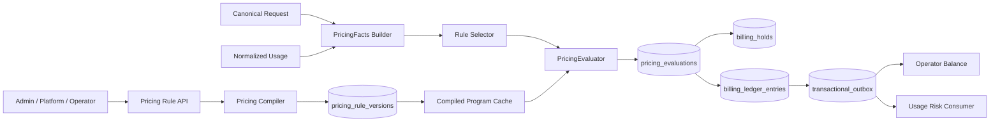
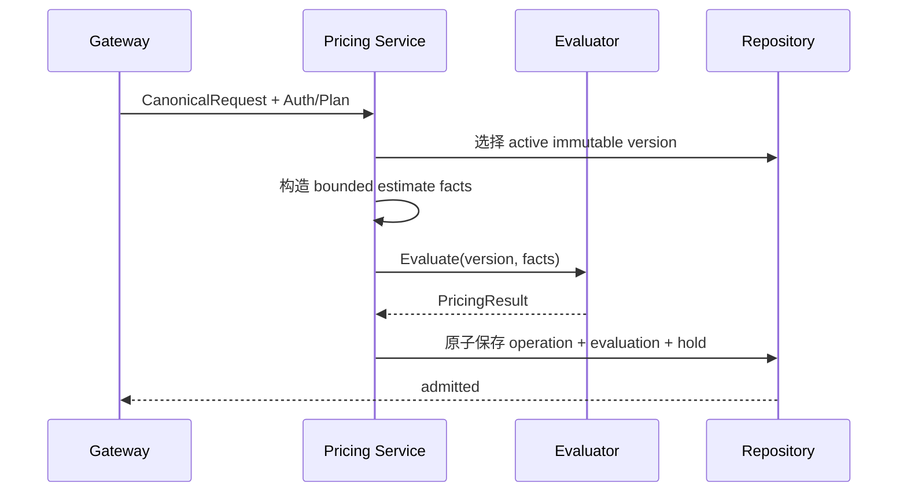
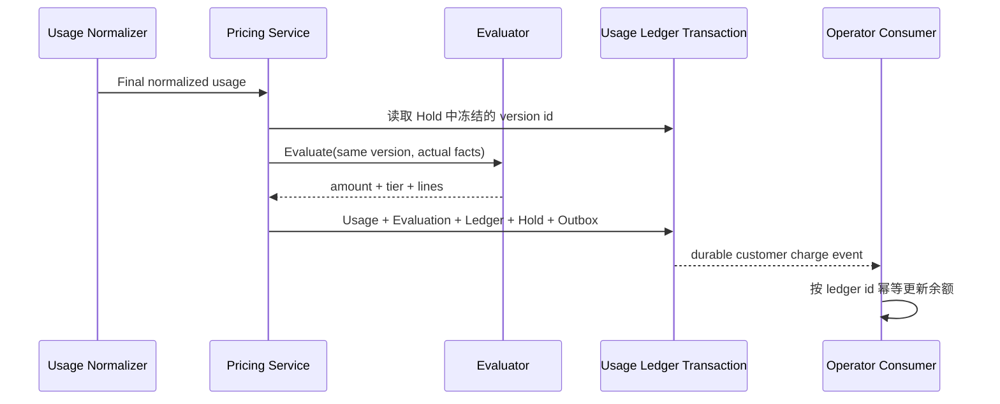

# AsterRouter 分层表达式计费方案

> 状态：已实施（研发期 clean break）；隔离 PostgreSQL 环境验收待补
>
> 制定日期：2026-07-16
>
> 适用范围：客户侧 Usage 成本、企业预算和 Operator 客户扣费；不替代供应商采购成本与账单对账
>
> 参考实现：本地 `new-api/pkg/billingexpr`、其规则编辑器和预估/结算链路；只吸收设计思想，不复制 AGPL 源码

[表达式引擎](./expression-engine.md) · [数据模型与账本](./data-model-and-ledger.md) · [API 与管理界面](./api-and-ui.md) · [实施计划](./implementation-plan.md) · [测试与发布门禁](./test-plan.md)

## 1. 结论

AsterRouter 应建设一个受限、可版本化、可重放的分层表达式计费引擎，但不能把 new-api 的 `billingexpr` 包直接移入当前代码库。

目标形态是：

1. `backend/internal/pricing` 只负责把冻结的规则版本和规范化计费事实计算成固定精度金额与明细。
2. Control Plane 负责规则选择、不可变版本、预占、最终结算、账本、审计和失败恢复。
3. Operator 不再二次读取自己的价格字段重新计算，而是消费已经冻结的 `customer_charge` 结果。
4. 供应商采购成本继续使用现有 `ProcurementPrice`、供应商账单和对账证据，不与客户售价混算。
5. 所有已发布规则都可用相同的规则版本、事实快照和引擎版本重放，缓存只是性能优化，不是事实来源。

本项目仍处于研发期，本方案采用 clean break：

- 删除 `model_pricings` 和 `operator_pricing_rules`，不保留旧表、旧读路径或投影层。
- 删除客户侧所有 cents 权威字段，预算、Usage、Ledger、Wallet、Balance、设置、报表、通知和 API 一次性改用 micros。
- 删除旧 Model Pricing API/DTO 和 Operator 浮点倍率请求，前后端同时切换到 Pricing Rule API。
- 删除 `EstimateModelUsageCostCents`、`usageChargeCents` 和 Observer 二次计价，不保留 feature flag 或 fallback。
- 开发数据库按新 Schema 重建，不提供旧开发数据升级、回填或双写。

实施顺序固定为：

```text
金额精度与币种约束
  -> 不可变价格规则版本
  -> 统一 PricingEvaluator
  -> 预占/结算/账本接入
  -> 可视化与原始表达式编辑器
  -> 删除旧实现并一次性切换
```

## 2. 当前问题

### 2.1 客户侧价格表达力不足

`controlplane.ModelPricing` 只有每百万输入、输出 Token 两个价格，无法表达：

- Claude 长上下文阶梯；
- 缓存读取、5 分钟缓存写入、1 小时缓存写入；
- 图片、音频、视频、字符、字节、动作和批次项；
- 每请求固定费；
- `service_tier`、协议、模态等经过白名单规范化的请求属性；
- 同一模型在不同 Operator Plan 下的售价。

与此同时，`UsageRecord` 和 `UsageDimensions` 已经保存多数计费事实，数据面具备承载条件。

### 2.2 存在两套客户定价计算

当前至少有两条相互独立的客户侧计算路径：

| 路径 | 主要数据 | 用途 | 当前问题 |
| --- | --- | --- | --- |
| `controlplane.model_pricings` | 输入/输出 cents per 1M | Usage 成本、月预算、Billing Hold、账本 | 规则原地修改，`PriceSnapshotID` 不是不可变快照 |
| `operator_pricing_rules` | Plan、模型、输入/输出价格、两个浮点倍率 | Operator 客户余额扣减 | Usage 持久化后由 Observer 再次计算，失败只记审计，缺少持久重试 |

同一请求可能产生两个不同金额。新方案统一计算内核和规则版本，但保留不同计价目的，避免把内部成本、客户售价和采购成本混成一个字段。

### 2.3 金额、币种与快照语义不完整

- `estimateCostCents` 对每个非零小请求直接向上取整到 1 cent，小额请求累计误差显著。
- Operator 余额扣费使用 `float64` 倍率并保证最低 1 cent，同样存在精度和放大问题。
- `ModelPricing` 允许任意三位币种，Usage Ledger 却固定写 `USD`。
- Billing Hold 保存可变价格记录 ID，最终结算 fallback 会重新读取当前价格。
- 已发布价格没有不可变规则版本，无法证明某条账单使用了什么公式。

这些问题必须在开放复杂表达式之前解决。

## 3. 目标与非目标

### 3.1 目标

- 支持输入、输出、上下文长度、缓存、多模态和通用 Usage Dimension 计费。
- 支持按规范化事实分层，并输出唯一命中 Tier。
- 预估和结算引用同一个不可变规则版本。
- 金额计算使用 `int64` 微美元，不使用浮点货币。
- 每次计算输出规则版本、表达式 Hash、事实 Hash、Tier 和计费行。
- 规则保存前完成语法、AST、事实、边界和样例验证。
- 规则运行失败时失效关闭或进入 disputed，不静默使用当前价格或估算金额。
- 直接替换 Admin/Platform/Operator 价格 API、DTO、页面和所有运行时调用点，不保留兼容层。
- Memory 与 PostgreSQL Repository 保持相同业务契约。

### 3.2 非目标

- 不在 V1 支持原始 Header、任意 JSONPath、Prompt 内容或上传文件内容参与计费。
- 不在 V1 调用 `time.Now()`、随机数、网络、数据库或外部服务。
- 不执行用户提供的脚本、Go 插件、WASM 或 JavaScript。
- 不在表达式里做外汇换算、税务、发票、支付、订阅或促销券结算。
- 不用客户侧售价反推供应商采购成本。
- 不在 V1 支持正则模型匹配、规则继承或任意多级 Price Book。
- 不承诺自动证明任意公式数学单调；预算预占依靠有界事实、验证和结算补差。
- 不在本专题新增 Operator 钱包的严格余额预占/授信模型；Outbox 保证最终幂等扣费，但并发请求是否允许余额变负沿用现有产品策略。若需要硬余额门禁，必须另建 `customer_balance_holds`，不能塞进表达式引擎。

## 4. 三种价格语义

| Purpose | 定义 | 规则系统 | 主要消费者 |
| --- | --- | --- | --- |
| `usage_cost` | AsterRouter 对下游 Usage 的内部成本/预算口径 | 新规则版本与表达式引擎 | Usage 报告、治理预算、Billing Hold、成本分摊 |
| `customer_charge` | Operator 客户实际应扣金额 | 新规则版本与表达式引擎 | Operator Balance、客户账单与额度 |
| `procurement_cost` | AsterRouter 向 Provider 采购的实际或估算成本 | 保留现有 `ProcurementPrice` 与账单对账域 | 有效价格、采购优化、供应商切换 |

约束：

- 三种 Purpose 不共享金额字段，不互相 fallback。
- `usage_cost` 与 `customer_charge` 可以命中不同规则，但都使用同一个纯计算接口。
- `procurement_cost` 可复用底层固定点数学工具，不能复用客户规则选择。
- V1 的预算与钱包只支持 `USD`；其他币种规则拒绝发布。未来引入独立 FX 快照后再扩展。

## 5. 总体架构



模块职责：

| 模块 | 单一职责 | 禁止事项 |
| --- | --- | --- |
| `internal/pricing` | 编译、校验、执行表达式，返回金额与明细 | 不访问 Repository，不决定客户/Plan，不写账本 |
| Rule Service | 规则选择、草稿、发布、回滚和 CAS | 不解析原始 Prompt，不自己计算金额 |
| Facts Builder | 把 Canonical Request、Usage 和 UsageDimensions 转为稳定事实 | 不读取价格，不做自动 Token 扣减 |
| Customer Pricing Resolver | 由 Operator 注入客户状态和冻结 Plan ID | 不返回价格公式，不让 Control Plane 反向导入 Operator |
| Billing Hold | 保存预估结果和规则版本，执行预算预占 | 不保存可变“当前规则”引用 |
| Usage Ledger | 原子保存最终 Usage、Evaluation、Ledger 和 Outbox | 不让 Observer 二次定价 |
| Operator Consumer | 按冻结金额幂等更新余额 | 不重新选择规则，不重新执行表达式 |
| Usage Risk Consumer | 按持久 Usage Event 评估风险规则 | 不读取价格规则，不写客户余额 |

## 6. 规则选择

V1 只支持精确模型和 `*` 通配规则，不支持正则或模型族推断。

`usage_cost` 的选择顺序：

1. `global + exact model`
2. `global + *`

`customer_charge` 的选择顺序：

1. `operator_plan + plan_id + exact model`
2. `operator_plan + plan_id + *`
3. `global + exact model`
4. `global + *`

数据库唯一约束保证每个选择槽位最多存在一个规则。不存在用规则 ID 字典序解决冲突的行为。

缺少规则的处理：

- 有月预算的请求缺少 `usage_cost`：入站拒绝 `pricing_unavailable`。
- Customer Key 缺少 `customer_charge`：入站拒绝，避免配置缺失变成免费调用。
- 无预算的内部请求缺少 `usage_cost`：允许转发，但 Usage 标记 `unpriced` 并产生告警。
- 免费模型必须发布显式返回 0 的规则，不能用“没有价格”表达免费。

Control Plane 通过窄接口获取 Operator 客户计价上下文：

```go
type CustomerPricingContextResolver interface {
	ResolveCustomerPricingContext(ctx context.Context, customerID string) (CustomerPricingContext, error)
	ValidatePricingPlan(ctx context.Context, planID string) error
}

type CustomerPricingContext struct {
	CustomerID string
	PlanID     string
	Status     string
	Currency   string
}
```

接口定义在 Control Plane 可依赖的边界中，由 Operator Service 实现并在 Runtime 注入。它只返回规则选择事实，不返回价格或执行计算，避免 `controlplane -> operator -> controlplane` 循环依赖。Customer Key Admission 无法解析有效上下文时失效关闭。

## 7. 预占与结算

### 7.1 预占



预估事实使用：

- 已知输入 Token 或安全估算；
- `max_tokens` / `max_completion_tokens`，缺失时使用按协议配置的保守默认值；
- 图片数量、音视频时长等请求上界；
- 规范化的协议、操作、模态、`service_tier` 等白名单属性；
- `operation.created_at` 作为冻结时间，仅用于未来显式开放的时间规则。

受预算约束但缺少必要上界的媒体请求继续拒绝，不能用 0 预占。

### 7.2 最终结算



同一 `operation + attempt + usage_version + purpose` 只允许一条最终账本记录。重放时金额、事实 Hash、规则版本或 Usage Record 不一致必须返回 `billing_ledger_conflict`。

## 8. 失败策略

| 阶段 | 故障 | 行为 |
| --- | --- | --- |
| 草稿验证 | 语法、未知变量、越权函数、溢出样例 | 拒绝保存/发布，返回稳定错误码和位置 |
| 入站预估 | 缺规则、缺事实、执行失败 | 受预算或 Customer Key 约束时拒绝；否则标记 unpriced |
| Provider 已消费后的结算 | 执行失败、事实缺失 | Usage 必须持久化；Evaluation 与 Hold 进入 disputed；不伪造金额 |
| Operator 扣费 | 数据库暂时失败 | Outbox 重试，超过上限进入 dead letter 并告警 |
| Hash 不一致 | 表达式与版本 Hash 不匹配 | 立即失效关闭，不编译、不命中缓存 |
| 缓存异常 | miss、淘汰、并发重复编译 | 回源不可变版本重新编译；不得改变结果 |

结算失败后不得使用：

- 当前 active 规则；
- Billing Hold 的估算金额；
- Provider 采购成本；
- 旧的输入/输出平价公式。

## 9. 与 new-api 的取舍

| new-api 设计 | 价值 | AsterRouter 选择 |
| --- | --- | --- |
| `expr-lang/expr` 编译与 VM | 成熟、无循环 DSL、支持类型环境 | 使用 MIT 依赖，自行实现领域层 |
| 表达式 Hash 缓存 | 热路径避免重复编译 | 使用 `engine_version + verified hash`，不信任调用方 Hash |
| `v1:` 前缀 | 可演进语义 | 未知版本明确拒绝，不默认回退 V1 |
| AST UsedVars | 可做依赖分析 | 只用于验证和审计，不据此隐式修改 Token |
| `tier(name, value)` Trace | 可解释分层 | 保留，并增加必须平衡的计费行明细 |
| `p/c` 自动排除缓存/媒体 | 适配不同 Provider Usage | 不采用；由 Usage Normalizer 输出显式事实 |
| `header/param/time` | 动态请求定价 | V1 不采用；仅白名单 Canonical Attributes 和冻结时间 |
| `float64 quota` | 适配 new-api Quota 体系 | 不采用；返回 `int64` 微美元 |
| 运行失败回退预扣额度 | 保持旧消费流程 | 不采用；进入 disputed 或入站拒绝 |
| 前端正则解析表达式 | 视觉/原始模式互转简单 | 后端 AST 返回分析模型，前端不自建第二个解析器 |

## 10. 安全、隐私与许可证

- 表达式只由授权管理员创建和发布；模拟接口仍执行大小、复杂度和频率限制。
- `PricingFacts` 不含 Prompt、响应正文、Secret、Bearer Token、原始 Header、原始 Body、IP 或上传内容。
- Evaluation 保存规范化事实 JSON 和 Hash；身份字段继续由 Operation/Usage 外键承载，不复制到表达式环境。
- 原始表达式进入审计，但错误消息不得包含请求内容。
- new-api 整体采用 AGPLv3 并带附加署名条款；AsterRouter 是 Apache-2.0。本方案不复制其源文件或前端实现。
- `github.com/expr-lang/expr` 为 MIT，可按依赖治理流程直接使用并补充第三方声明。

## 11. 成功标准

- Claude 长上下文、缓存读写和至少一种非 Token Usage Dimension 能由单条已发布规则正确计价。
- 价格在请求执行期间发布新版本，正在执行的请求仍使用旧版本完成结算。
- 相同规则版本和事实重复计算得到逐位相同的金额、Tier 与明细。
- 所有最终账本记录都能关联规则版本和 Pricing Evaluation。
- Customer Charge 只计算一次，Operator 仅消费冻结金额。
- 小额请求以微美元累计，不再强制每请求最低 1 cent。
- Hash 篡改、未知版本、表达式过大、算术溢出和缺失事实均失效关闭。
- 仓库中不存在旧价格表、旧 cents DTO、旧计价 Helper 或第二条 Operator 计价路径。
- Memory/PostgreSQL 契约、重启持久化、并发发布和幂等重放测试全部通过。

## 12. 参考代码

new-api：

- `/Users/coso/Documents/dev/go/new-api/pkg/billingexpr/compile.go`
- `/Users/coso/Documents/dev/go/new-api/pkg/billingexpr/run.go`
- `/Users/coso/Documents/dev/go/new-api/pkg/billingexpr/settle.go`
- `/Users/coso/Documents/dev/go/new-api/pkg/billingexpr/types.go`
- `/Users/coso/Documents/dev/go/new-api/pkg/billingexpr/expr.md`
- `/Users/coso/Documents/dev/go/new-api/setting/billing_setting/tiered_billing.go`
- `/Users/coso/Documents/dev/go/new-api/relay/helper/price.go`
- `/Users/coso/Documents/dev/go/new-api/service/tiered_settle.go`
- `/Users/coso/Documents/dev/go/new-api/web/default/src/features/pricing/lib/billing-expr.ts`
- `/Users/coso/Documents/dev/go/new-api/web/default/src/features/system-settings/models/tiered-pricing-editor.tsx`

AsterRouter 当前边界：

- `backend/internal/controlplane/model_pricing.go`
- `backend/internal/controlplane/billing_hold.go`
- `backend/internal/controlplane/operation_repository.go`
- `backend/internal/controlplane/usage_dimension.go`
- `backend/internal/controlplane/effective_pricing_usage.go`
- `backend/internal/operator/service.go`
- `backend/internal/operator/repository.go`
- `frontend/src/views/admin/AdminModelPricingsView.vue`
- `frontend/src/views/operator/OperatorPricingView.vue`
